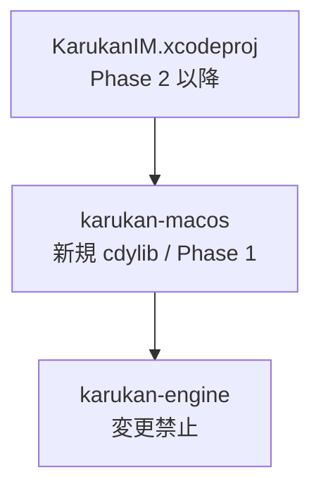
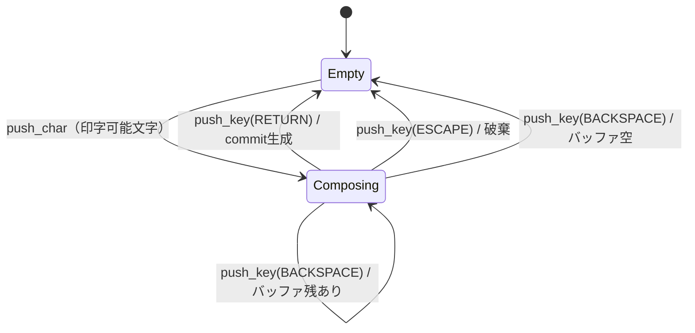

# Phase 1 実装計画書: Rust FFI クレート (`karukan-macos`)

> ブランチ: `feature/macos-phase1-ffi`
> 前提: `epic/macos` から切る
> 完了条件: `cargo test -p karukan-macos` が全パス

---

## 目標

`karukan-engine` をmacOS向けにラップした `cdylib` を作成する。
**Phase 1 スコープはローマ字→ひらがな変換のみ**。漢字変換・モデルロードは Phase 3 で追加する。

---

## 依存関係の設計判断

### `karukan-im` には依存しない

`karukan-im` は `InputMethodEngine` という高機能な状態機械を持つが、以下の理由で `karukan-macos` の依存には使わない。

| 問題 | 内容 |
|---|---|
| `Settings::data_dir()` / `Settings::learning_file()` | XDGパスをハードコードしている（macOSで `None` になる） |
| `Settings::learning_file()` が `save_learning` 内部で呼ばれる | macOS向けパスを外部から渡す手段がない |
| `karukan-im` クレートの責務 | Linux/fcitx5専用と明示されており変更禁止 |

### `karukan-engine` に直接依存する

`karukan-macos` は `karukan-engine` の公開APIのみを使用し、独自の `KarukanSession` 状態機械を実装する。これは `karukan-im/src/core/engine/` が `karukan-engine` をラップしているのと同じ構造。



---

## ファイル構成と各ファイルの責務

```text
karukan-macos/
├── Cargo.toml
└── src/
    ├── lib.rs              # クレートルート。モジュール宣言のみ
    ├── session.rs          # KarukanSession 型（非公開の状態機械）
    ├── platform/
    │   ├── mod.rs
    │   └── paths.rs        # macOS データディレクトリ解決
    └── ffi/
        ├── mod.rs          # ffi_ref!/ffi_mut! マクロ、ログ初期化
        ├── lifecycle.rs    # session_new / session_init / session_free
        ├── input.rs        # push_char / push_key
        ├── query.rs        # get_preedit / get_commit / is_empty 等
        └── tests.rs        # FFI境界テスト
```

---

## `Cargo.toml`

`crate-type = ["cdylib", "lib"]` の両方を指定する。`cdylib` のみだと `cargo test` が動かないため、`lib` も指定することで Rust 単体テストが実行できる。

依存クレート: `karukan-engine`（workspace）、`anyhow`、`tracing`、`tracing-subscriber`、`dirs`。

---

## `session.rs` — 状態機械

### 設計方針

Phase 1 では `Empty` / `Composing` の 2 状態のみ。
`Conversion` 状態（候補選択）は Phase 3 で追加する。



### 構造体

`KarukanSession` は以下のフィールドを持つ:

- `state: SessionState` — Empty / Composing
- `romaji: RomajiConverter` — ローマ字変換器
- `input_buf: InputBuffer` — ひらがなテキスト + カーソル位置（文字数オフセット）
- `preedit: PreeditCache` — FFI返却用 CString キャッシュ（text / `caret_bytes` / dirty フラグ）
- `commit: CommitCache` — commit テキストキャッシュ（text / dirty フラグ）

`InputBuffer` はひらがなテキストとカーソル位置を管理する。文字の挿入・削除・バイトオフセット計算を担う。

### 主要メソッド（実装指針）

- `push_char(ch)` — `RomajiConverter.push(ch)` を呼び、`output()` の差分のみを `input_buf` に追記する（delta 追跡）。preedit = `input_buf.text + romaji.buffer()`
- `push_key(key)` — Empty 時は全スルー。Composing 時に Return/Escape/Backspace を処理
- `do_commit()` — `romaji.flush()` で残留ローマ字をひらがなに変換して `input_buf` に追記 → commit 生成 → `romaji.reset()` + `input_buf.clear()`
- `do_cancel()` — `romaji.reset()` + `input_buf.clear()`
- `do_backspace()` — `romaji.backspace()` の結果で分岐（下記「実装上の注意事項」参照）

---

## `platform/paths.rs`

macOS データディレクトリを解決する。テスト・CI では `KARUKAN_DATA_DIR` 環境変数で上書き可能。

| 関数 | パス |
|---|---|
| `app_support_dir()` | `~/Library/Application Support/Karukan/` |
| `models_dir()` | `app_support_dir/models/` |
| `learning_cache_path()` | `app_support_dir/learning.tsv` |
| `user_dict_dir()` | `app_support_dir/user_dicts/` |
| `system_dict_path()` | `app_support_dir/dict.bin` |

`dirs::data_local_dir()` は macOS で `~/Library/Application Support/` を返す。

---

## `ffi/mod.rs` — 共通マクロとログ初期化

- `ffi_ref!(ptr, default)` — null チェック + 共有参照取得（戻り値あり関数用）
- `ffi_mut!(ptr)` / `ffi_mut!(ptr, default)` — null チェック + 可変参照取得
- `init_logging()` — `Once` で1回だけ `tracing_subscriber` を初期化（stderr出力、`RUST_LOG` 環境変数対応）

---

## `ffi/lifecycle.rs` — セッション生成・初期化・解放

### `karukan_session_new`

軽量生成（モデルロードなし）。メインスレッドで安全に呼べる。失敗時は null を返す。`catch_unwind` で panic が FFI 境界を越えないようにする。

### `karukan_session_init`

Phase 1 では辞書・学習キャッシュのロードのみ。ファイルが存在しない場合は非致命的スキップ。現時点では常に 0（成功）を返す。

`init_resources()` の処理順:
1. `system_dict_path()` が存在すれば `Dictionary::load()` → `self.dict`（失敗時は warn ログのみ）
2. `learning_cache_path()` が存在すれば `LearningCache::load()` → `self.learning`（存在しなければ空で初期化）
3. Phase 3 で追加: `KanaKanjiConverter` のロード（バックグラウンドスレッド必須）

> **Phase 3 でのバックグラウンドスレッド化**: モデルロード（数秒〜数十秒）が追加されると
> メインスレッドブロックが問題になる。Swift 側の呼び出しを Phase 2 から
> `DispatchQueue.global().async` にしておくことで、Phase 3 での変更が Swift 側不要になる。

### `karukan_session_free`

学習キャッシュを保存してから drop する。`catch_unwind` で panic でも leak しない。

---

## `ffi/input.rs` — 文字・キー入力

### `KarukanKey` enum

`#[repr(u32)]` で定義し、C ヘッダーの enum と値を一致させる。

| 値 | キー |
|---|---|
| 1 | Return |
| 2 | Backspace |
| 3 | Escape |
| 4 | Space |
| 5 | Left |
| 6 | Right |
| 7 | Up |
| 8 | Down |
| 9 | Tab |

### `karukan_push_char`

印字可能な UTF-8 文字（1コードポイント）を受け取る。制御文字は無視。戻り値: 1=IMEが消費, 0=スルー。

### `karukan_push_key`

特殊キーの `u32` 値を受け取る。戻り値: 1=IMEが消費, 0=スルー。

---

## `ffi/query.rs` — 状態取得

| 関数 | 説明 |
|---|---|
| `karukan_get_preedit` | preedit テキストへの CString ポインタ（次の push_* まで有効） |
| `karukan_get_preedit_len` | preedit バイト長 |
| `karukan_get_preedit_caret` | キャレット位置（バイトオフセット） |
| `karukan_has_commit` | commit が生成されていれば 1 |
| `karukan_get_commit` | commit テキストへの CString ポインタ |
| `karukan_is_empty` | Empty 状態なら 1 |
| `karukan_save_learning` | 学習キャッシュを即時保存 |

Swift 側は `String(cString:)` で即コピーすること（ポインタの長期保持は危険）。

`save_learning()` は `LearningCache::is_dirty()` を確認してから保存する（変更がなければスキップ）。親ディレクトリは自動作成。

---

## Cヘッダーファイル (`karukan-macos/include/karukan_macos.h`)

Swift との FFI ブリッジに使用する。全公開関数を宣言する。

- **ライフサイクル**: `karukan_session_new`, `karukan_session_init`, `karukan_session_free`
- **入力**: `karukan_push_char`, `karukan_push_key`
- **状態取得**: `karukan_get_preedit`, `karukan_get_preedit_len`, `karukan_get_preedit_caret`, `karukan_has_commit`, `karukan_get_commit`, `karukan_is_empty`, `karukan_save_learning`

---

## `ffi/tests.rs` — FFI 境界テスト

テストは `cargo test -p karukan-macos` で実行する。`KARUKAN_DATA_DIR` を tempdir に設定してファイルシステムを汚染しない。

テストヘルパー `TestSession` 構造体でセッションの生成・操作・解放をラップし、`Drop` で自動解放する。

### テストケース一覧

| テスト名 | 検証内容 |
|---|---|
| `test_session_lifecycle` | `new` → `init` → `free` がクラッシュしない |
| `test_null_safety` | 全関数に null を渡してもクラッシュしない |
| `test_basic_romaji_a` | `push_char("a")` → preedit == "あ" |
| `test_romaji_ka` | `push_char("k")` → preedit == "k", `push_char("a")` → preedit == "か" |
| `test_commit_on_return` | "a" + RETURN → `has_commit` == 1, commit == "あ" |
| `test_escape_cancel` | "ai" + ESCAPE → preedit_len == 0, `has_commit` == 0 |
| `test_backspace_romaji_buf` | "k" + BACKSPACE → preedit_len == 0 |
| `test_backspace_hiragana` | "ka" + BACKSPACE → preedit == "k" ... → preedit_len == 0 |
| `test_is_empty_after_cancel` | ESCAPE後に `is_empty` == 1 |
| `test_preedit_valid_utf8` | preedit ポインタが valid null-terminated UTF-8 |
| `test_preedit_pointer_stability` | 次の push_* 前はポインタが変化しない |
| `test_panic_safety` | 意図的 panic が FFI 境界を越えないこと（catch_unwind で処理） |
| `test_save_learning_no_crash` | `save_learning` が tempdir に保存してクラッシュしない |

---

## ワークスペースへの追加

ルートの `Cargo.toml` の `[workspace] members` に `"karukan-macos"` を追加する。

---

## 実装上の注意事項

### `RomajiConverter` の公開 API（確認済み）

`karukan-engine/src/romaji/converter.rs` を直接確認した結果を以下に記す。

#### メソッド一覧

| メソッド | シグネチャ | 説明 |
|---|---|---|
| `push` | `fn push(&mut self, ch: char) -> ConversionEvent` | 文字を追加して変換試行。**内部で `to_ascii_lowercase()` するため大文字も受け付ける** |
| `backspace` | `fn backspace(&mut self) -> BackspaceResult` | 1文字削除。下記 variant 参照 |
| `flush` | `fn flush(&mut self) -> String` | バッファ残留分を強制変換して返す。同時に `output` にも追記される |
| `buffer` | `fn buffer(&self) -> &str` | 未確定ローマ字バッファ（例: "k", "sh"） |
| `output` | `fn output(&self) -> &str` | **累積値**。`reset()` するまで追記され続ける |
| `reset` | `fn reset(&mut self)` | `buffer` と `output` を両方クリア |
| `full_text` | `fn full_text(&self) -> String` | `output` と `buffer` を結合した文字列 |

#### `ConversionEvent` variants

- `Converted(String)` — ひらがなに変換された（例: "ka" → "か"）
- `Buffered` — バッファに追加されて待機中（例: "k"）
- `PassThrough(char)` — 変換ルールなし

#### `BackspaceResult` variants（計画書初版の `Consumed`/`NotConsumed` は誤り）

- `RemovedBuffer(char)` — 未確定ローマ字バッファから削除した
- `RemovedOutput(char)` — 確定済み output から削除した（= input_buf からも削除が必要）
- `Empty` — バッファも output も空だった

> **`RemovedOutput` 時の注意**: `romaji.output` から文字が消えた場合、
> その文字は `push_char()` 内の delta 追跡で `input_buf` に既に `insert()` 済み。
> `do_backspace()` では `RemovedOutput` を受け取ったら `input_buf.delete_before_cursor()` も呼ぶ必要がある。

#### `output()` の累積仕様と delta 追跡

`output()` は毎 push で追記される累積値のため、`push_char()` では push 前の `output().chars().count()` を記録し、push 後に差分のみを `input_buf` に insert する delta 追跡が必要。

### `catch_unwind` の制限

クロージャ内で `&mut KarukanSession` を使う場合、`UnwindSafe` を満たさないため `AssertUnwindSafe` でラップが必要になることがある。

### `cdylib` + `lib` の同時指定

- `cargo build` → `libkarukan_macos.dylib`（Xcodeに埋め込む）
- `cargo test` → rlib ベースのテストバイナリ（`#[test]` が動く）

---

## 完了条件（acceptance criteria）

### Rust ビルド・テスト

- [x] `cargo build -p karukan-macos --release` が成功する
- [x] `cargo test -p karukan-macos` が全パスする
- [x] `cargo clippy -p karukan-macos` が警告なし
- [x] `cargo fmt -p karukan-macos -- --check` が通る
- [x] `include/karukan_macos.h` が存在し、全公開関数の宣言が含まれる
- [x] null ポインタテストが全パスする（クラッシュゼロ）

### dylib 検査（Phase 2 の Xcode 統合前に問題を潰す）

Xcode への埋め込み可否は Phase 2 まで確認できないが、以下を Phase 1 で検証して「埋め込み可能な状態」を保証する。

- `nm -D` で全 `karukan_*` シンボルが `T` セクションに現れること
- `otool -L` に Linux 固有の依存（`libpthread.so` 等）がないこと
- `dlopen` + `push_char("a")` → preedit `"あ"` のスモークテストが成功すること

> `otool -D` の dylib ID は Phase 1 時点では絶対パスでも問題ない。Xcode の Build Phase で `install_name_tool -id "@rpath/libkarukan_macos.dylib"` を適用する前提。

- [x] `nm -D` で全公開シンボルが確認できる
- [x] `otool -L` に Linux 固有の依存がない
- [x] `dlopen` スモークテストが成功する（`push_char("a")` → preedit `"あ"`）

> **Xcode 統合での残存リスク**: `.appex` バンドルへの埋め込み後の `@rpath` 解決、
> および `install_name_tool` 適用後の動作確認は Phase 2 で行う。

---

## Phase 2 への引き継ぎ事項

Phase 1 完了時に以下の状態であること：

1. `libkarukan_macos.dylib` が `target/release/` に生成されている
2. `include/karukan_macos.h` が存在する
3. `karukan_push_key(KARUKAN_KEY_SPACE)` は現在「全角スペースとして確定」する（Phase 3 で変換トリガーに変更）
4. `karukan_session_init` は辞書・学習キャッシュのロードのみ（モデルロードは Phase 3 で追加）
5. Swift 側は Phase 2 から `DispatchQueue.global().async { karukan_session_init(session) }` で呼ぶように実装する（Phase 3 のモデルロード追加に対応するため）
