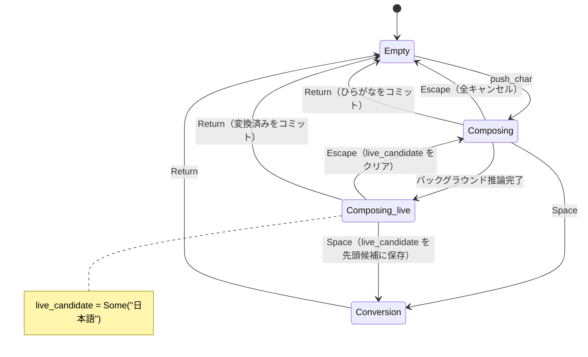
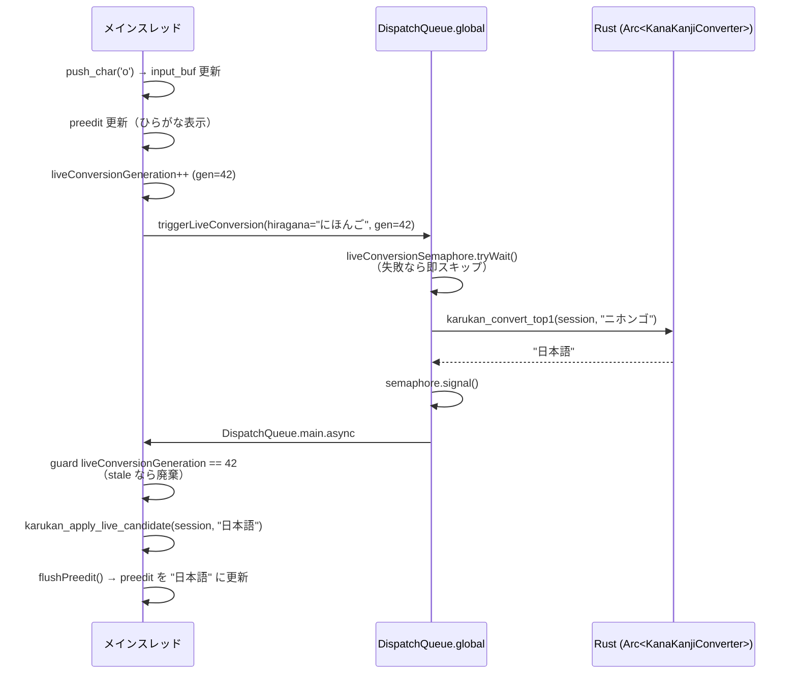

# Phase 3.5 実装計画書: ライブ変換

> 前提: Phase 3（漢字変換 + 候補 UI）完了・動作確認済み
> 完了条件: タイピング中にリアルタイムで変換候補が preedit に反映される

---

## 概要

ライブ変換とは、スペースキーを押さなくても入力中のひらがなをリアルタイムで漢字変換し、preedit に反映し続ける機能。Enter で確定、Space で通常の候補選択モードへ移行する。

- `nihongo` と入力すると、候補ウィンドウなしで preedit が「日本語」に変わる
- そのまま Enter → 「日本語」をコミット
- Space → 候補ウィンドウを表示（Phase 3 と同じ）

---

## karukan-im との設計比較

Linux 版 `karukan-im` を参照した。ライブ変換の核心的な設計は同じだが、**macOS はメインスレッドをブロックできない**ため、非同期化が必要。

| 点 | karukan-im (Linux) | macOS |
|---|---|---|
| 状態 | `Composing` のまま、`live.text: String` フィールド | `Composing` のまま、`live_candidate: Option<String>` フィールド |
| 推論 | 同期（fcitx5 は独立プロセス、短時間ブロック可） | 非同期（メインスレッドブロック禁止） |
| Escape | 2段階（live クリア → 全キャンセル） | 同じ |
| Space | live_text を先頭候補として Conversion へ | 同じ |
| デバウンス | なし | なし（karukan-im に倣う） |

### karukan-im から学んだ重要な点

1. **新しい State は不要** — `SessionState::LiveConverting` は作らない。`Composing` のまま `live_candidate: Option<String>` フィールドだけで管理（`karukan-im` の `live.text` に相当）。

2. **2段階 Escape** — ライブ変換表示中の Escape は live_candidate をクリアしてひらがな表示に戻る。2回目でキャンセル。

3. **Space → Conversion 時の継続性** — `live_candidate` を `prev_suggest_text` として Conversion の先頭候補に保存（表示が途切れない）。

4. **Enter 確定** — `live_candidate` が Some なら変換済み文字をコミット、None ならひらがなをコミット（現状の `do_commit()` と同じ）。

---

## アーキテクチャ

### 状態遷移（Phase 3.5 追加分）



### 非同期推論フロー



---

## Rust 側変更（`karukan-macos/src/session.rs`）

### 1. `KarukanSession` に `live_candidate` フィールドを追加

- `live_candidate: Option<String>` を追加（`karukan-im` の `live.text` に相当）
- `new()` で `None` で初期化する

### 2. `do_commit()` を修正（Enter 確定）

- ローマ字バッファをフラッシュし、未確定文字を `input_buf` に反映する
- `live_candidate` が `Some` の場合はその変換済みテキストをコミットし、学習キャッシュに記録する
- `None` の場合は従来通り `input_buf.text` をそのままコミットする
- コミット後は `input_buf`、`romaji`、`state` をリセットして Empty に遷移する

### 3. `do_cancel()` を修正（2段階 Escape）

- `live_candidate` が `Some` のとき: `take()` でクリアし、ひらがな + romaji_buf を preedit に表示して返る（2段階の1回目）
- `live_candidate` が `None` のとき: romaji・input_buf をリセットして Empty に遷移する（2段階の2回目）

### 4. `do_conversion()` を修正（Space → live_candidate を先頭候補に）

- `collect_candidates()` 呼び出し前に `live_candidate.take()` で値を取り出す
- 候補リストに `live_candidate` が含まれていない場合のみ先頭に挿入する（karukan-im の `prev_suggest_text` 処理）
- これにより、ライブ変換で表示していた結果が候補ウィンドウ表示後も先頭に残る

### 5. `apply_live_candidate()` を追加

- バックグラウンドスレッドの推論結果をメインスレッドから適用する関数
- `live_candidate` にセットし、preedit を変換済みテキストに更新する
- Swift 側の世代カウンタで stale な結果は事前に弾くため、ここでは無条件に適用する

---

## Rust 側変更（`karukan-macos/src/ffi/`）

### 6. `ffi/query.rs` — `karukan_get_composing_hiragana` を追加

バックグラウンドスレッドが推論を起動する前に、メインスレッドで現在のひらがなを取得するための関数。

- `Composing` 状態でなければ 0 を返す
- UTF-8 バイト列を呼び出し側のバッファにコピーし、コピーした文字数を返す
- **メインスレッドからのみ呼ぶこと**（セッション状態への読み取りアクセス）

### 7. `ffi/query.rs` — `karukan_convert_top1` / `karukan_free_string` を追加

バックグラウンドスレッドから安全に呼べる変換 API。**セッションのミュータブルな状態には触れず、`Arc<KanaKanjiConverter>` のみを使う**。

- `karukan_convert_top1`: ひらがなをカタカナに変換して推論し、上位1候補をヒープ確保した C 文字列として返す
    - `converter` が `None`（モデル未ロード）の場合は `null` を返す
    - `Arc<KanaKanjiConverter>` は `Send + Sync` のためバックグラウンドスレッドから安全に呼べる
- `karukan_free_string`: `karukan_convert_top1` が返したポインタを解放する

### 8. `ffi/input.rs` — `karukan_apply_live_candidate` を追加

- バックグラウンド推論の結果をセッションに適用する。**メインスレッドからのみ呼ぶこと**
- `Composing` 状態でなければ 0 を返して無視する
- 成功時は 1 を返す（preedit が dirty になる）

### 9. `karukan-macos/include/karukan_macos.h` に宣言を追加

追加する C API の概要：

| 関数名 | 役割 | 呼び出しスレッド |
|---|---|---|
| `karukan_get_composing_hiragana` | Composing 状態のひらがなをバッファにコピー | メインスレッド |
| `karukan_convert_top1` | ひらがな→上位1候補（ヒープ確保 C 文字列） | バックグラウンド可 |
| `karukan_free_string` | `karukan_convert_top1` の戻り値を解放 | バックグラウンド可 |
| `karukan_apply_live_candidate` | 推論結果をセッションに適用 | メインスレッド |

---

## Swift 側変更（`KarukanInputController.swift`）

### 10. generation counter とライブ変換トリガー

追加するプロパティ：

- `liveConversionGeneration: Int` — push_char のたびにインクリメントする世代カウンタ。バックグラウンドで完了した推論が stale かどうかを判定するために使う
- `liveConversionSemaphore: DispatchSemaphore(value: 1)` — 同時推論を1件に制限する。前の推論が走っていれば新規タスクをスキップ（非ブロッキング `tryWait`）し、スレッド飽和・ビーチボールを防ぐ
- `kLiveConversionMaxChars = 15` — ライブ変換を起動する最大ひらがな文字数。超過時は変換完了後に自動コミットして新規 Composing に移行する

`triggerLiveConversion` の処理フロー：

1. `karukan_get_composing_hiragana` でひらがなを取得（0 ならスキップ）
2. `liveConversionGeneration` をインクリメントして現在の世代 `gen` を保存
3. `DispatchQueue.global` で非同期実行開始
4. セマフォの `tryWait` を試みる（取得できなければスキップ）
5. `karukan_convert_top1` で推論を実行し、結果を `karukan_free_string` で解放
6. `DispatchQueue.main.async` でメインスレッドに戻る
7. 世代カウンタが `gen` と一致しなければ廃棄（stale チェック）
8. `karukan_apply_live_candidate` を適用し、ひらがな文字数が上限超えなら自動コミット（`returnKey` を送信）
9. `updateClientState` で preedit を更新する

### 11. `handle(_:client:)` での呼び出し

- `push_char` 経由で文字が処理されたとき（`consumed == true`）、`triggerLiveConversion(sender:)` を呼び出す
- `push_key` パス（Space・Enter・Escape など）では呼ばない

### 12. generation counter のリセット

- `updateClientState` 内などで `karukan_is_empty` を確認し、Empty になったタイミングで `liveConversionGeneration` をインクリメントする
- これにより、残存する非同期タスクが完了しても適用されなくなる

---

## preedit 表示の変化

| 状態 | preedit の内容 |
|---|---|
| Composing, live=None | ひらがな（下線付き）例: `にほんご` |
| Composing, live=Some | 変換済みテキスト 例: `日本語` |
| Conversion | 選択中候補（ハイライト）例: `日本語` |

---

## テスト要件

### ライブ変換の基本動作

```text
[x] "nihongo" 入力中に候補ウィンドウなしで preedit が「日本語」になる
[x] Enter で「日本語」がコミットされる（ひらがなでなく変換済み）
[x] Escape 1回目: preedit が「にほんご」に戻る
[x] Escape 2回目: 入力全キャンセル（preedit 消える）
```

### Space → Conversion との連携

```text
[x] ライブ変換中（「日本語」表示）に Space → 候補ウィンドウが開く
[x] その際「日本語」が先頭候補として残っている
```

### 学習キャッシュとの連携

```text
[x] Enter でライブ変換をコミットすると learning.tsv に記録される
[x] 次回同じ読みで learning 候補が先頭に来る
```

### 非同期安全性

```text
[x] 高速タイピング中にクラッシュしない
[x] stale な推論結果が混入しない（世代カウンタで弾かれる）
     確認: log stream | grep "stale discarded" で廃棄ログが出ることを観察
[x] 同時推論が 1 件に制限される（DispatchSemaphore）
     確認: log stream | grep "inference busy" でスキップログが出ることを観察
[x] 長文入力（>15文字）で自動コミットされ、ビーチボールが起きない
     確認: log stream | grep "auto-commit" で自動コミットログが出ることを観察
[ ] モデルロード前（converter = None）でもクラッシュしない
```

---

## 既知リスク

| # | リスク | 対処 |
|---|---|---|
| R1 | バックグラウンド中に session が解放される | `weak self` + `guard session` で防ぐ |
| R2 | 推論が重く毎キー起動するとスレッド飽和・ビーチボール | **対処済み**: セマフォ（同時1件）+ 長文自動コミット（`kLiveConversionMaxChars = 15`）で解決 |
| R3 | `karukan_convert_top1` が session の他フィールドに触れるバグ | コードレビューで `converter` フィールドのみアクセスすることを確認 |
| R4 | ライブ変換結果がひらがなと同じ（モデル未ロード時など）| `apply_live_candidate` を適用するが視覚変化なし。許容範囲 |

---

## 完了条件（Acceptance Criteria）

- [x] `cargo build -p karukan-macos` がエラーなく成功する
- [x] "nihongo" 入力中にスペース不要で「日本語」が preedit に表示される
- [x] Enter で「日本語」がコミットされる
- [x] Escape 2段階が正しく動く（live クリア → 全キャンセル）
- [x] Space で候補ウィンドウが開き、live 候補が先頭に残っている
- [x] 高速タイピング（100ms/key 以下）でクラッシュしない
- [x] `log stream --predicate 'subsystem == "com.example.karukan"'` でエラーログが出ない

---

## Phase 3.7: 子音 pending 遅延表示

### 概要

ローマ字入力で子音キー（k, s, t, …）を打った瞬間、preedit に「k」が一瞬表示されてからかなに変わる"ちらつき"が発生する。これを解消するため、**子音のみ pending の状態では preedit 更新を一定時間（デフォルト 0.1s）遅延**し、後続キーが来ればかなだけを表示する。

- 高速入力時（0.1s 以内に次キー）: 「k」が preedit に表示されず、直接「か」が表示される（ちらつきなし）
- 低速入力時（0.1s 以上待つ）: タイマー発火後に「k」が表示される（従来通り）

### 設計方針

- **Rust 側は即座にキーを処理する**（romaji の状態は常に最新）
- **Swift 側で preedit の UI 更新のみを遅延する**（Timer ベース）
- 遅延秒数は `config.toml` の `consonant_delay_sec` で設定可能（デフォルト 0.1、0 なら即表示＝従来動作）
    - 当初 0.2s で実装したが体感でもたつきがあったため 0.1s に調整

### Rust 側変更

#### `session.rs` — `is_consonant_pending()` を追加

romaji converter に未確定の子音が残っているか（母音待ち状態か）を判定する関数。

- `romaji.has_pending()` の結果を返す
- `input_buf` にすでにかなが存在するかは問わない（「か**k**」の 2 文字目の "k" でも遅延する）
- Swift 側が preedit 遅延の判定に使う

#### `ffi/query.rs` — `karukan_is_consonant_pending` を追加

- 子音 pending であれば 1、それ以外は 0 を返す C API
- `session.is_consonant_pending()` を呼び出してラップする

#### `karukan_macos.h` に宣言を追加

- `int karukan_is_consonant_pending(const KarukanSession* session)` を追加

### Swift 側変更（`KarukanInputController.swift`）

#### プロパティ追加

- `consonantDelayTimer: Timer?` — 子音 pending 遅延表示用タイマー。タイマー発火前に次のキーが来ればキャンセルされ、ちらつきを防ぐ
- `consonantDelaySec: TimeInterval = 0.1` — 子音 pending 遅延秒数（0 で無効＝従来動作）

#### `handle(_:client:)` の変更フロー

1. 既存の遅延タイマーをキャンセル（`consonantDelayTimer?.invalidate()`）
2. Rust にキーを送る（常に即座に処理）
3. `push_char` のとき `triggerLiveConversion` を起動
4. 子音 pending 状態（`karukan_is_consonant_pending != 0`）なら:
    - 候補パネルは即更新（preedit だけ遅延）
    - タイマーをセットし、発火時に `updateClientState` を呼ぶ
5. 通常パス: 即座に `updateClientState` + `updateCandidatesPanel`

#### `deactivateServer` でのクリーンアップ

- `deactivateServer` 時に `consonantDelayTimer?.invalidate()` を呼び、タイマーを破棄する

### ライブ変換との相互作用

| シナリオ | 動作 |
|---------|------|
| ライブ変換 OFF + 子音 pending | preedit 更新を遅延。タイマー発火で「k」を表示 |
| ライブ変換 ON + 子音 pending | preedit 更新を遅延。かなが生成されてからライブ変換が走る（子音のみでは推論不要） |
| 子音の後すぐに母音 | タイマーをキャンセル → 即座にかな表示 → ライブ変換トリガー |

子音 pending の間はかなが生成されていないため `triggerLiveConversion` は `karukan_get_composing_hiragana` が 0 を返してスキップされる。つまり **遅延機能とライブ変換は干渉しない**。

### テスト要件

```text
[x] "ka" を高速入力（< 0.1s 間隔）→ "k" が preedit に表示されず「か」だけ表示
[x] "k" を入力して 0.1s 以上待つ → preedit に "k" が表示される
[x] "k" の後に "k" → "っ" に変換される（タイマーリセット動作）
[x] consonantDelaySec = 0 の場合 → 従来動作（即座に "k" を表示）
[x] 子音 pending 中にアプリ切替（deactivateServer）→ クラッシュしない
[x] ライブ変換 ON 時: "nihongo" 高速入力 → ちらつきなく「日本語」が表示される
```

### 設定

将来的に `~/.config/karukan-im/config.toml` で遅延秒数を設定可能にする。設定キーは `[input]` セクションの `consonant_delay_sec`（型: float、デフォルト: 0.1、0 で無効）。

---

## Phase 3.8: ライブ変換 preedit 安定化

### 概要

Phase 3.5 のライブ変換では、キー入力のたびに preedit がひらがなに一瞬戻る「フリッカー」や、文字数の増減によるカーソルジャンプが発生していた。Phase 3.8 ではこれらを解消し、preedit の表示を安定化させる。

### 問題 1: 連続キー入力でひらがなフォールバック

#### 症状

「オフィシャルオンライ」を入力後に `n` → `n` と続けると、2回目の push_char 後に preedit がひらがな（`おふぃしゃるおんらいん`）に戻る。

#### 原因

`push_char()` 内で `live_candidate` を `take()`（ムーブ）していたため、1回目の push_char で `live_candidate` が消費される。子音遅延で1回目の preedit 更新がスキップされると、2回目では `None` になりひらがなにフォールバックしていた。

#### 修正

`take()` を `clone()` に変更。`live_candidate` は `apply_live_candidate()` が新しい結果で上書きするか、`do_commit()` / `do_cancel()` で消費されるまで保持し続ける。

### 問題 2: Backspace 後に stale な live_candidate が残留

#### 症状

「オフィシャル」を入力後に Backspace で全削除し、再び `o` を入力すると、削除済みのライブ変換結果が一瞬復活してから消える。

#### 原因

`clone()` 化により Backspace で文字を全削除しても `live_candidate` がクリアされなくなった。

#### 修正

`do_backspace()` で `self.live_candidate = None` を追加。Backspace は文字を減らす操作なのでライブ変換結果は無条件にクリアする。

### 問題 3: かな確定時のカーソルジャンプ

#### 症状

「今日h」の後に `a` を入力すると、preedit が一瞬「今日」（文字減）に戻り、その後「今日は」（文字増）になるためカーソルが前後にジャンプして不快になる。

#### 原因

preedit を `prev_live + romaji_buf` で構築していたため、子音が母音と結合してかなになると romaji_buf が空になり、新しいかなが反映されない中間状態が発生していた。

#### 修正

preedit を `prev_live + new_hiragana + romaji_buf` で構築するように変更。新たに生成されたかなを即座に prev_live に付加することで文字数が減る中間状態を防ぐ。

- 修正前: `「今日h」→「今日」→「今日は」`（文字減→増、カーソルジャンプ）
- 修正後: `「今日h」→「今日は」→「今日は」`（文字数単調増加、スムーズ）

---

## Phase 4 への引き継ぎ事項

1. ライブ変換の **有効/無効トグル**（Ctrl+Shift+L 相当）— Phase 4 で設定 UI を追加する際に実装。
2. ライブ変換で文節分割が必要なケース（長い文）— 現在は全体を1候補として扱う。将来的には karukan-im の `ParallelBeam` 戦略を参考に複数候補を活用する。
3. **パフォーマンス計測** — `karukan_convert_top1` の実行時間を計測し、`kLiveConversionMaxChars`（現在 15）の適切な値を調整する。さらに短縮が必要な場合はキャンセル機構（`Task` + cooperative cancellation）の導入を検討。
