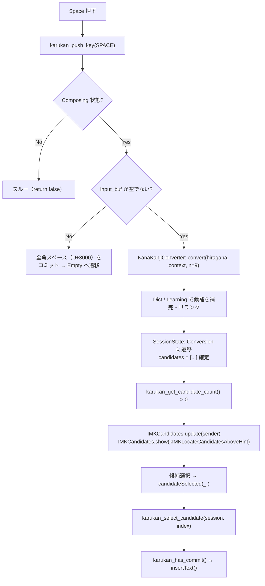
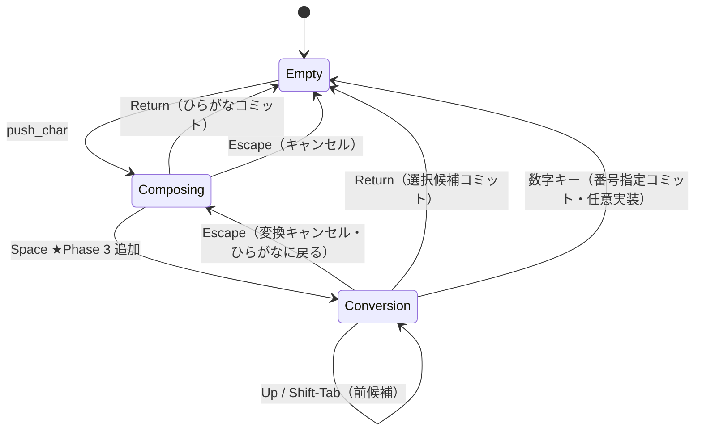

# Phase 3 実装計画書: 漢字変換 + 候補 UI 統合

> ブランチ: `feature/macos-phase3-candidates`
> 前提: `feature/macos-phase2-imk` 完了・マージ済み
> 完了条件: スペースキーで変換候補を表示し、選択して漢字をコミットできること

---

## 目標

`karukan-engine` の `KanaKanjiConverter`（llama.cpp ベース）を統合し、
ひらがな → 漢字変換を macOS 上で動作させる。

スペースキーで変換を起動し、候補ウィンドウから選択して確定するまでの一連のフローを実現する。
例: `konnnichiha` [Space] → 候補ウィンドウに「こんにちは / 今日は / 今日和 ...」を表示 → [Return] で「今日は」をコミット。

---

## 現状確認（Phase 2 完了時点）

| 項目 | 状態 |
|---|---|
| ローマ字 → ひらがな | ✅ 動作中 |
| `KanaKanjiConverter` 統合 | ❌ 未実装（`session.rs` の `init_resources` に TODO あり） |
| Space キーの動作 | ⚠️ 全角スペース挿入（Phase 3 で変換トリガーに変更） |
| `karukan_get_candidate_count` / `karukan_get_candidate` | ❌ 未実装（ヘッダーに宣言済みなら有効化） |
| `IMKCandidates` | ❌ 未実装 |
| 辞書・学習キャッシュの変換への反映 | ❌ 未実装（ロードのみ） |

---

## アーキテクチャ

### 変換フロー



### 状態遷移（Phase 3 追加分）



---

## Rust 側変更（`karukan-macos`）

### 1. `session.rs`

#### `SessionState` に `Conversion` を追加

`SessionState` 列挙型に `Conversion(ConversionState)` バリアントを追加する。
`ConversionState` は以下のフィールドを持つ:

- `hiragana: String` — 変換対象のひらがな（Escape でひらがな編集に戻る際に使用）
- `candidates: Vec<String>` — 変換候補リスト（Learning → Dict → Model 順でリランク済み）
- `cursor: usize` — 現在選択中の候補インデックス

#### `KarukanSession` に `converter` フィールドを追加

`KarukanSession` 構造体に以下を追加する:

- `converter: Option<KanaKanjiConverter>` — ロード済みの変換器（失敗時は `None`）
- `candidate_cache: CandidateCache` — FFI から参照される候補の `CString` リストと選択カーソル

#### `init_resources` にモデルロードを追加

既存の辞書・学習キャッシュのロード処理に続けて、`Backend::from_variant_id("default")` で
モデルバックエンドを初期化し、`KanaKanjiConverter::new(backend)` で変換器を生成して
`self.converter` にセットする。初回起動時は HuggingFace から GGUF を自動ダウンロードする。
失敗した場合は `None` のまま警告ログを出す（次セッションでリトライ可能）。

> **注意**: `init_resources` は Swift 側でバックグラウンドスレッドから呼ばれるため、
> モデルのダウンロード（初回のみ）を含む重い処理でも問題ない。

#### `push_key(Space)` を変換トリガーに変更

Composing 状態での Space キーハンドラを以下の挙動に変更する:

- Phase 1 の全角スペース挿入を削除し、`do_conversion()` を呼ぶ
- `do_conversion` の処理手順:
  1. ローマ字バッファをフラッシュしてひらがなを確定
  2. `input_buf.text` が空なら全角スペース（U+3000）をコミットして Empty に遷移（Phase 1 互換）
  3. 空でなければ `collect_candidates(&hiragana)` で候補を収集
  4. 候補を `candidate_cache` に格納し、`SessionState::Conversion` に遷移
  5. preedit に先頭候補を下線付きで表示

`collect_candidates` の優先順位:

1. 学習キャッシュ（最優先）— `learning.get_top(hiragana)` で上位 1 件
2. モデル変換 — `converter.convert(hiragana, "", 9)` で最大 9 候補
3. システム辞書（フォールバック）— `dict.lookup(hiragana)` 上位 5 件
4. 候補なしの場合はひらがなをそのまま返す

重複候補は除去し、優先順位の高いものが先頭に来るよう整列する。

#### Conversion 状態のキーハンドラ

| キー | 動作 |
|---|---|
| Return | 選択候補を学習キャッシュに記録してコミット、Empty へ遷移 |
| Escape | ひらがな編集状態（Composing）に戻す |
| Space / Tab / Down | 次候補に移動（循環）、`candidate_cache.cursor` を更新 |
| Up / Shift-Tab | 前候補に移動（循環）、`candidate_cache.cursor` を更新 |

#### `karukan_select_candidate` のセッション側実装

`select_candidate(index: usize)` メソッドを追加する。
`IMKCandidates` でのクリック選択に対応し、以下を行う:

- Conversion 状態でなければ `false` を返す
- 指定インデックスの候補を取り出し、学習キャッシュに記録
- コミットフラグをセットして Empty に遷移、preedit をクリア

---

### 2. `ffi/query.rs` に候補 API を追加

以下の3つの FFI 関数を公開する:

- `karukan_get_candidate_count(session)` — 変換候補の件数を返す（変換中でなければ 0）
- `karukan_get_candidate(session, index)` — index 番目の候補テキスト（null 終端 UTF-8 ポインタ）を返す。ポインタは次の push_*/select_candidate 呼び出しまで有効
- `karukan_get_candidate_cursor(session)` — 現在選択中の候補インデックスを返す

いずれも `catch_unwind` で Rust パニックから保護し、失敗時は 0 または null ポインタを返す。

### 3. `ffi/input.rs` に `karukan_select_candidate` を追加

`karukan_select_candidate(session, index)` FFI 関数を追加する。
`session.select_candidate(index as usize)` を呼び、成功なら 1、失敗なら 0 を返す。
`catch_unwind` でパニック保護済み。

### 4. `karukan-macos/include/karukan_macos.h` に宣言を追加

C ヘッダーに以下の4関数を宣言する:

| 関数 | 説明 |
|---|---|
| `karukan_get_candidate_count(session)` | 変換候補の数を返す。変換中でなければ 0 |
| `karukan_get_candidate(session, index)` | index 番目の候補テキスト（null 終端 UTF-8）へのポインタを返す |
| `karukan_get_candidate_cursor(session)` | 現在選択中の候補インデックスを返す |
| `karukan_select_candidate(session, index)` | 候補を index で選択してコミット。戻り値: 1=成功、0=失敗 |

---

## Swift 側変更（`KarukanInputController.swift`）

### 変更点サマリー

1. `IMKCandidates` プロパティを追加
2. `init` で `IMKCandidates` を生成
3. `handle(_:client:)` で候補ウィンドウの表示/非表示を制御
4. `candidates(_:)` を実装（Rust から候補を取得）
5. `candidateSelected(_:)` を実装（クリック選択）

### 主な実装ポイント

- `IMKCandidates` はセッションごとではなく `IMKServer` と 1:1 で生成する（`init` で一度だけ生成）
- `karukan_session_init` はバックグラウンドスレッドで実行し、完了後に `initialized = true` をメインスレッドでセット
- `handle(_:client:)` は `push_key` / `push_char` の呼び出し後に `updateClientState` と `updateCandidatesPanel` を呼ぶ
- `candidates(_:)` は `karukan_get_candidate_count` と `karukan_get_candidate` で Rust 側の候補リストを取得して返す
- `candidateSelected(_:)` は受け取った文字列から候補インデックスを逆引きして `karukan_select_candidate` を呼び、コミット後にパネルを非表示にする
- `updateCandidatesPanel` は候補数が 0 より大きければ `panel.update` + `panel.show(kIMKLocateCandidatesAboveHint)` を呼び、0 なら `panel.hide()` する

---

## モデルダウンロード

`karukan_session_init` → `init_resources` → `Backend::from_variant_id("default")` が
HuggingFace から GGUF を自動ダウンロードする（`karukan-engine` の既存実装）。

保存先: `~/Library/Application Support/Karukan/models/`

**初回起動時の注意**:
- ダウンロードはバックグラウンドスレッドで実行されるためメインスレッドはブロックしない
- ダウンロード完了前に Space キーを押した場合、候補は辞書・学習キャッシュのみになる
- `initialized` フラグが `true` になってからモデルロード完了まで数秒かかる可能性がある
- ログ: `karukan_session_init returned: 0` が出力されれば完了

---

## テスト要件

### 基本変換

```text
[x] "nihongo" [Space] → 候補ウィンドウに「日本語」等が表示される
[x] 候補を選択 [Return] → 「日本語」がコミットされる
[x] "nihongo" [Space] [Space] → 次の候補に移動する
[x] "nihongo" [Space] [Escape] → ひらがな編集状態に戻る（「にほんご」preedit 表示）
[x] 候補ウィンドウでクリック → candidateSelected が呼ばれてコミットされる
```

### 学習キャッシュ

```text
[x] 「日本語」を選択コミット後、再度 "nihongo" [Space] → 「日本語」が先頭候補になる
```

### エッジケース

```text
[ ] モデルロード前に [Space] → 辞書のみの候補が表示される（クラッシュしない）
[x] 変換中にフォーカスを失う → deactivateServer で先頭候補をコミット
[x] 変換候補が 1 件の場合 → パネル表示（1 件でもパネルを出す）
```

---

## 既知リスク

| # | リスク | 対処 |
|---|---|---|
| R1 | llama.cpp の `generate_beam_search` が重く候補表示に時間がかかる | `num_candidates` を減らす / greedy decoding でまず 1 候補を出す |
| R2 | `App Sandbox + HuggingFace ダウンロード` が失敗する | `com.apple.security.network.client` entitlement が必要（Phase 4 で追加） |
| R3 | `IMKCandidates` のパネルが preedit と被る / 位置がずれる | `kIMKLocateCandidatesAboveHint` を他のヒントに変えて調整 |
| R4 | `Dictionary::lookup` のシグネチャが不明 | karukan-engine の API を確認後実装 |
| R5 | モデルなし環境で `Backend::from_variant_id` がパニック | `Result` 型で受けているため `catch_unwind` で保護済み |

---

## 完了条件（Acceptance Criteria）

- [x] `cargo build -p karukan-macos` がエラーなく成功する
- [x] ビルド後 `~/Library/Input Methods/KarukanIM.app` に自動インストールされる
- [x] "nihongo" → Space で候補ウィンドウが開く
- [x] Return で選択候補がコミットされる
- [x] Escape でひらがなに戻る
- [x] 2 回目の変換で学習した候補が先頭に来る
- [ ] クラッシュなし（Console.app でクラッシュログが出ない）

---

## Phase 4 への引き継ぎ事項

1. **`ENABLE_HARDENED_RUNTIME = NO`** は Phase 4 で `YES` に戻す必要がある。
   llama.cpp が JIT または unsigned executable memory を使う場合は
   `com.apple.security.cs.allow-unsigned-executable-memory` entitlement が必要（要動作確認）。

2. **`ENABLE_APP_SANDBOX = YES` + ネットワーク**: HuggingFace DL のために
   `com.apple.security.network.client` を entitlements に追加する。

3. **`com.example.inputmethod.KarukanIM`** は仮 Bundle ID。
   Phase 4 で Apple Developer Program の正式 ID に変更する。
