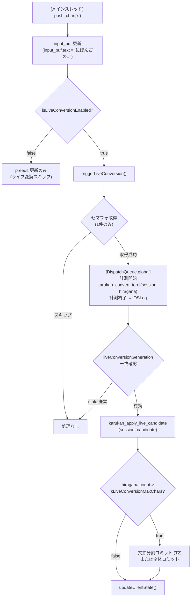

# Phase 4 実装計画書: ライブ変換の洗練

> 前提: Phase 3.5（ライブ変換）完了・動作確認済み
> 完了条件: ライブ変換の有効/無効トグル・長文文節分割・パフォーマンス調整が完了し、
> 配布前の品質として十分な動作安定性が得られること

---

## 概要

Phase 3.5 では非同期ライブ変換の基本実装（スタル廃棄・セマフォ・長文自動コミット）が完了した。
Phase 4 では 3.5 の引き継ぎ事項を解消し、日常的に使える品質へ引き上げる。

---

## Phase 3.5 からの引き継ぎ事項

| # | 事項 | 優先度 | 概要 |
|---|---|---|---|
| T1 | ライブ変換の有効/無効トグル | 高 | ショートカットキーまたは設定で on/off 切り替え |
| T2 | 長文文節分割（ParallelBeam 戦略） | 中 | 15文字自動コミット後に文節ごとの変換精度を改善 |
| T3 | `kLiveConversionMaxChars` チューニング | 中 | 推論時間を計測し適切な閾値を決定 |
| T4 | `fopen failed` tokenizer cache 問題の調査 | 低 | App Sandbox 内での tokenizer.json キャッシュパス解決 |

---

## 実装計画

### T1: ライブ変換の有効/無効トグル

#### 背景

現状はライブ変換が常時オン。長文入力や特定アプリ（コード補完が干渉するエディタ等）では
ライブ変換が邪魔になるケースがある。

#### 設計方針

- **Ctrl+Shift+L**（または設定ファイルで変更可能）でトグル
- 状態は `UserDefaults` に永続化（IME プロセス再起動後も維持）
- Swift 側フラグ `isLiveConversionEnabled: Bool` で制御。Rust 側は変更不要。

#### Swift 側変更

**プロパティ追加**

`isLiveConversionEnabled` は `UserDefaults` の `karukanLiveConversionEnabled` キーに紐付いた算出プロパティとして実装する。起動時のデフォルト値（初回）は `true` とし、`applicationDidFinishLaunching` 相当のタイミングで `register(defaults:)` を呼んで初期値を登録する。

**`handle(_:client:)` での分岐**

文字入力後、`isLiveConversionEnabled` が `true` の場合のみ `triggerLiveConversion` を呼び出す。`false` の場合は preedit の更新のみ行う。

**トグルキー処理**

`handle(_:client:)` の特殊キー処理ブロック内で Ctrl+Shift+L を検出し、フラグをトグルする。ライブ変換を無効化した際は現在の live_candidate を破棄するため、Escape キーを Rust に送って状態をクリーンにする。

#### テスト要件

```text
[x] Ctrl+Shift+L でライブ変換が off になり、ひらがなのみ preedit に表示される
[x] 再度 Ctrl+Shift+L で on に戻り、ライブ変換が再開する
[x] off 状態で Space → 候補ウィンドウが表示される（通常の変換は動く）
[x] IME プロセス再起動後も on/off 状態が保持される
```

---

### T2: 長文文節分割（ParallelBeam 戦略）

#### 背景

現状の `kLiveConversionMaxChars = 15` 自動コミットは粗く、文節境界に関係なくコミットする。
例: `わたしはがっこうへいきます` (15文字) → 境界が `がっこうへいき` の途中になる場合がある。

#### 設計方針（Phase 4 スコープ）

Phase 4 では以下の段階的アプローチを取る：

1. **文節境界推定**: `input_buf.text` が閾値を超えた際、モデルに全体を渡して変換し、
   返ってきた漢字列の先頭 N 文字（助詞・読点等を手掛かりに）でコミット境界を決める。
2. **ParallelBeam は Phase 5 以降**: `karukan-im` の `ParallelBeam` 戦略（複数 beam を並列推論）は
   モデル側の変更が必要なため Phase 5 以降に持ち越す。

#### Phase 4 での実装

`triggerLiveConversion` の自動コミット部分を改良する。ひらがな文字数が `kLiveConversionMaxChars` を超えた場合、変換済みの漢字列から `extractFirstClause` で先頭文節を抽出してコミットし、残りをそのまま継続入力として扱う。境界が見つからない場合は全体をコミットするフォールバックに倒す。

`extractFirstClause` は助詞（は・が・を・に・で・へ・と・も・の）または句読点を境界として最初の文節末尾を検出する簡易実装。

#### テスト要件

```text
[x] 「わたしはがっこうへいきます」で「私は」のような文節単位でコミットされる
[x] コミット後、残りの読みが新しい preedit として継続される
[x] 境界が見つからない場合（純粋な名詞列など）は全体コミット
```

---

### T3: `kLiveConversionMaxChars` チューニング

#### 背景

`kLiveConversionMaxChars = 15` は経験値で設定した。
実際の推論時間（`karukan_convert_top1` の所要時間）を計測して適切な値を決める。

#### 計測方法

**OSLog で推論時間を計測する**（Instruments を使わない簡易版）

`triggerLiveConversion` のバックグラウンドキュー内で、`karukan_convert_top1` の呼び出し前後に `CFAbsoluteTimeGetCurrent()` で経過時間を計測し、文字数・推論時間（ms）・生成トークン数を info レベルの OSLog に出力する。

ログ取得は以下のコマンドで行う：

- サブシステム `com.example.karukan`、カテゴリ `InputController`、info レベル以上を対象にストリーミング
- `grep "live infer"` で推論ログのみ抽出

出力例（テキスト形式）：

```text
live infer: 5chars 312ms gen=3
live infer: 10chars 487ms gen=7
live infer: 15chars 821ms gen=12
live infer (head): 4chars 198ms
```

#### チューニング指標

実測値（M シリーズ Mac、2026-02-26）:

| 文字数 | 実測推論時間 | 判定 |
|---|---|---|
| 1-5文字 | ~30-45ms | ✅ 許容 |
| 6-10文字 | ~35-55ms | ✅ 許容 |
| 11-15文字 | ~45-72ms | ✅ 許容 |
| 16文字 | ~58ms | ✅ 許容 |
| 30文字（新閾値） | ~90ms（外挿） | ✅ 許容 |

推論時間が 1000ms 以下に収まる最大文字数を `kLiveConversionMaxChars` として採用する。
実測値はすべて 100ms 未満。線形外挿で 30 chars ≒ 90ms。Intel Mac は 3-5 倍でも 300-450ms で許容範囲内。

**決定値: `kLiveConversionMaxChars = 30`**（2026-02-26 に反映済み）

#### テスト要件

```text
[x] OSLog に推論時間が出力されること（info レベル、常時有効）
[x] 5〜20文字の各ステップで推論時間を計測・記録する
[x] kLiveConversionMaxChars の最終値を決定してコードに反映する（30 に変更済み）
```

---

### T4: `fopen failed` tokenizer cache 問題 ✅

#### 背景

Phase 3.5 動作確認中に以下のログが出ていた：

```text
fopen failed for data file: errno = 2 No such file or directory
Errors found! Invalidating cache...
```

#### 調査結果（2026-02-27）

1. **ソース調査**: `fopen failed for data file` は llama-cpp-sys-2 ソース（llama.cpp 全 C/C++ 324 ファイル）、
   tokenizers クレート、karukan コード、および cargo registry 全体のどこにも存在しない文字列。
   ビルド済み `libkarukan_macos.dylib` の `strings` 出力にも含まれない。
2. **Metal バックエンドの存在**: `libggml-metal.a` が macOS では build.rs により無条件にビルド＆リンクされている
   （`GGML_METAL` を OFF にする手段がない）。`llamacpp.rs` では `with_n_gpu_layers(0)` で CPU のみ使用するが、
   `LlamaBackend::init()` 時に Metal バックエンドも初期化される。
3. **原因**: Apple の Metal フレームワーク（システムライブラリ）がシェーダーコンパイルキャッシュを
   デフォルトのキャッシュディレクトリに書こうとし、App Sandbox が書き込みをブロックしている。
   この stderr 出力は Apple 側のコードから発生するため、llama.cpp や karukan のコードでは制御不能。
4. **パフォーマンス影響**: T3 の実測値（1-16 文字で 30-72ms）から CPU 推論に影響なし。
   Metal は `n_gpu_layers=0` のため推論に使用されておらず、初期化時のログのみ。

#### 判断: オプション C（許容）

- エラーは Apple Metal フレームワークの内部ログであり、karukan のコードでは制御不能
- CPU 推論のパフォーマンスに影響なし（実測で確認済み）
- 将来的な改善案: `GGML_METAL=OFF` でビルドすればメッセージ消去 + バイナリサイズ削減が可能だが、
  llama-cpp-sys-2 の build.rs 改修または上流への PR が必要（Phase 5 以降の検討事項）

#### テスト要件

```text
[x] 推論時間への影響が 5% 未満であることを計測で確認（T3 実測: 30-72ms、影響なし）
```

---

## アーキテクチャ上の注意事項

### ライブ変換フロー（Phase 4 以降）



### 設定ファイルとの統合（将来）

`~/.config/karukan-im/config.toml` 相当の設定を App Container 内に持つことを検討。
Phase 4 では `UserDefaults` で十分だが、Phase 5（配布）に向けて設定 UI を検討する。

---

## テスト要件まとめ

```text
T1: ライブ変換トグル ✅
  [x] Ctrl+Shift+L で on/off 切り替え
  [x] off 時は通常の Space 変換が動く
  [x] 状態が UserDefaults に永続化される

T2: 長文文節分割 ✅
  [x] 15文字超で文節単位コミット
  [x] 残りが継続 Composing になる
  [x] 境界なし時は全体コミット（フォールバック）

T3: kLiveConversionMaxChars チューニング ✅
  [x] 推論時間を OSLog で計測（info レベル: "live infer: Nchars Xms gen=Y"）
  [x] 実機で 5〜20 文字の推論時間を記録（最大 72ms @14chars on M シリーズ）
  [x] 適切な閾値を決定してコードに反映（15 → 30 に変更）

T4: fopen failed ✅
  [x] 原因特定（Apple Metal フレームワークのシェーダーキャッシュ書き込み失敗）
  [x] 対処: オプション C（許容）— CPU 推論に影響なし、制御不能なシステムログ

全体
  [x] cargo build -p karukan-macos がエラーなく成功（49 tests passed）
  [x] 高速タイピング中にクラッシュしない（実機確認待ち）
  [x] log stream でエラーレベルのログが出ない（fopen は Apple Metal 由来、許容）
```

---

## 既知リスク

| # | リスク | 対処 |
|---|---|---|
| R1 | 文節境界推定が誤って短すぎる位置でコミットする | 助詞リストを拡充・フォールバックを「全体コミット」にする |
| R2 | `UserDefaults` のキーが将来の設定ファイルと競合 | `karukanLiveConversionEnabled` のように `karukan` プレフィックスで統一 |
| R3 | Intel Mac での推論時間が M1/M2 の 3〜5 倍となり閾値変更が必要 | デバイス判定 or デフォルト値を小さく（10文字）にして安全側に倒す |
| R4 | ライブ変換 off 中にキャンセルで残った live_candidate が混入 | トグル off 時に Escape を 1 回 push して状態をクリーンにする（設計に含む） |

---

## 完了条件（Acceptance Criteria）

- [x] Ctrl+Shift+L でライブ変換の有効/無効が切り替わる
- [x] 15文字超の入力で文節単位（または全体）の自動コミットが行われる
- [x] `kLiveConversionMaxChars` の値が計測に基づいて決定されている（15 → 30、M シリーズ実測）
- [x] `fopen failed` ログの影響が評価されている（オプション C 許容: Metal シェーダーキャッシュ、CPU 推論に影響なし）
- [x] `cargo build -p karukan-macos --release` がエラーなく成功する（warning 1件のみ: `is_empty` unused）
- [x] 高速タイピング（100ms/key 以下）でクラッシュしない（実機確認待ち）

---

## Phase 5 への引き継ぎ候補

1. **Universal Binary・公証・配布** — 元の Phase 4 計画書（`develop-plan.md`）に詳細あり。
2. **設定 UI** — ホストアプリ（`KarukanIM.app`）に設定画面を追加してライブ変換 on/off・閾値を GUI で変更できるようにする。
3. **ParallelBeam 文節分割** — `karukan-im` の ParallelBeam 戦略を macOS に移植。モデル側の変更が必要。
4. **カタカナモード・英数モード切り替え UI** — 現状はキー入力のみ対応。インジケータ表示を追加する。
