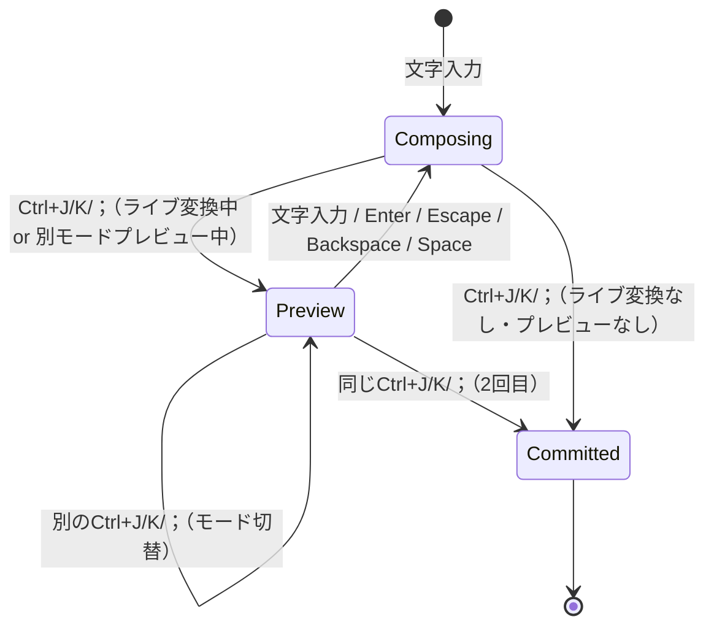

# Phase 5: 設定・キーボードショートカット・インジケーターアイコン

> 前提: Phase 4（ライブ変換の洗練）完了・動作確認済み
> 完了条件: 入力メニューによる設定 UI、標準キーボードショートカット、
> カスタムインジケーターアイコンが動作すること
>
> **実装状況**: T1 ✅ / T2 ✅ / T3 ✅

---

## 概要

Phase 5 では IME としての完成度を日常利用レベルに引き上げる。以下の 3 項目を実装する。

| # | 項目 | 概要 |
|---|---|---|
| T1 | 設定（入力メニュー） | メニューバーの入力メニューからライブ変換・子音遅延・自動コミット閾値を変更 |
| T2 | キーボードショートカット | Ctrl+J/K/; による変換確定、JIS かな/英数キーの消費 |
| T3 | インジケーターアイコン | メニューバーのアイコンを「あ」等のカスタム画像に変更 |

---

## T1: 設定（入力メニュー）

### 背景

ユーザーが設定値を GUI で変更する手段として、当初 `.prefPane`（PreferencePanes.framework）を
検討したが、appex ベースの IME ではシステム環境設定に表示されなかった。
そこで入力メニュー（メニューバーのドロップダウン）にサブメニューとして設定項目を配置し、
`UserDefaults(suiteName:)` で永続化する方式に切り替えた。

### 設計方針

- `menu()` オーバーライドで `NSMenu` を構築し、設定項目をサブメニューで提供する
- 設定値は `SettingStore`（`UserDefaults(suiteName:)`）に保存
- IME 側は毎回 UserDefaults から読むため、設定変更は次のキー入力から即時反映

### 設定項目

| 設定キー | 型 | デフォルト | メニュー UI | 説明 |
|---|---|---|---|---|
| `karukanLiveConversionEnabled` | Bool | `true` | チェックマーク付きトグル | ライブ変換の有効/無効 |
| `karukanConsonantDelaySec` | Double | `0.1` | サブメニュー（なし/0.05/0.10/0.15/0.20/0.30 秒） | 子音 pending 遅延秒数 |
| `karukanAutoCommitMaxChars` | Int | `30` | サブメニュー（10/20/30/40/50 文字） | 自動コミット閾値（文字数） |

### メニュー構造

```text
┌─────────────────────────┐
│ ✓ ライブ変換            │
├─────────────────────────┤
│   子音遅延          ▶   │──┐
│   自動コミット閾値  ▶   │  │ ┌──────────────┐
├─────────────────────────┤  └─│   なし        │
│   設定...               │    │   0.05 秒     │
└─────────────────────────┘    │ ✓ 0.10 秒     │
                               │   0.15 秒     │
                               │   0.20 秒     │
                               │   0.30 秒     │
                               └──────────────┘
```

### 設定基盤: SettingStore + UserDefaults

`SettingStore` は `UserDefaults(suiteName:)` をラップした共有ストアで、
IME の Swift コードから設定値を読み書きする。
設定値は computed property で毎回 UserDefaults から読み取るため、
メニューから変更した値は次のキー入力時に自動的に反映される。

- `SettingStore.defaults` — suiteName 付きの `UserDefaults` インスタンスを返す
- `consonantDelaySec` — `karukanConsonantDelaySecKey` の値を読む（未設定時は `0.1`）
- `autoCommitMaxChars` — `karukanAutoCommitMaxCharsKey` の値を読む（未設定時は `30`）

### テスト要件

```text
[x] 入力メニューに「ライブ変換」「子音遅延」「自動コミット閾値」「設定...」が表示される
[x] 「ライブ変換」クリックでチェックマークが切り替わり、動作が反映される
[x] 「子音遅延」サブメニューで値を選択すると UserDefaults に保存され、現在値にチェックマーク
[x] 「自動コミット閾値」サブメニューで値を選択すると UserDefaults に保存される
[x] IME 側で設定値が即時反映される
[x] IME プロセス再起動後も設定が保持される
```

---

## T2: キーボードショートカット・入力メニュー

### 背景

macOS 標準の日本語入力では以下のショートカットが使える。karukan でも対応したい。
また、メニューバーの入力メソッドアイコンをクリックした際のドロップダウンメニュー（入力メニュー）に
項目を追加し、ライブ変換の切り替えや設定画面へのアクセスを提供する。

### 対応するショートカット

| ショートカット | 動作 | macOS 標準 |
|---|---|---|
| Ctrl+J | 入力中のテキストをひらがなに変換して確定 | あり |
| Ctrl+K | 入力中のテキストをカタカナに変換して確定 | あり |
| Ctrl+Shift+L | ライブ変換の on/off トグル | karukan 独自（実装済み） |
| Ctrl+; | 入力中のテキストを半角英数に変換して確定 | あり |

### 設計方針

- Rust 側に新しいキーコード（`KARUKAN_KEY_CONVERT_HIRAGANA` 等）を追加する
- Swift 側は修飾キー + keyCode を検出して対応する `karukan_push_key` を呼ぶ
- Rust 側で `input_buf.text` を変換してコミットする

### Rust 側変更

#### `KarukanKey` enum への追加

`karukan-macos/src/ffi/mod.rs` に以下の3つのキーコードを追加する:

| 定数名 | 値 | 用途 |
|---|---|---|
| `KARUKAN_KEY_CONVERT_HIRAGANA` | `10` | Ctrl+J — ひらがな確定 |
| `KARUKAN_KEY_CONVERT_KATAKANA` | `11` | Ctrl+K — カタカナ確定 |
| `KARUKAN_KEY_CONVERT_ASCII` | `12` | Ctrl+; — 半角英数確定 |

#### `session.rs` — 変換コミット処理（プレビューモード対応）

ライブ変換中に Ctrl+J/K/; を押すと即コミットせず、まずプレビュー表示（preedit をひらがな/カタカナ/英数に切替）する。同じキーをもう一度押すと確定する。異なるキーを押すとモードが切り替わる（Escape の2段階動作と同じ思想）。

処理フローは以下の通り:



`convert_preview` フィールドで現在のプレビューモード（Hiragana / Katakana / Ascii）を管理する。
`convert_preview` は文字入力・Enter・Escape・Backspace・Space でクリアされる。

#### `session.rs` — ひらがな→ローマ字逆変換テーブル

`karukan-engine` の `rules.rs` と同じルール一覧から逆引きテーブルを構築する。
`karukan-engine` は変更禁止のため、`karukan-macos` 側に逆変換ロジックを持つ。

逆変換テーブルの設計方針:

- `REVERSE_ROMAJI` を `Vec<(&str, &str)>` として `Lazy` で初期化（ひらがな → ローマ字）
- 拗音・特殊音（「きゃ」→`kya`、「しゃ」→`sha` 等）を単独かなより先に定義し、最長一致を保証
- ひらがなの文字列長の降順にソートする
- テーブルに存在しないかな（句読点等）はそのまま出力に渡す

> **「ん」の扱い**: `nn` を採用（`n` 単独だと次の文字と結合する可能性があるため）。
> 厳密には後続文字によって `n` / `nn` を切り替えるべきだが、Phase 5 では `nn` 固定とする。

### Swift 側変更

`handle(_:client:)` の修飾キーチェック部分を拡張する。

> **注意**: 現在の実装では `flags.contains(.control)` で `return false` しているため、
> Ctrl+J/K/; のチェックは**この早期リターンより前に配置する**必要がある。
> Ctrl+Shift+L（既存）と同じ位置に並べる。

各ショートカットの処理は次の手順で行う:

- 修飾キーフラグと keyCode の組み合わせを検出する（J=38、K=40、;=41）
- 対応する `karukan_push_key` を呼び出す
- `updateClientState` で preedit を更新する
- 候補パネルを非表示にする
- `true` を返してキーイベントを消費する

### `KarukanMacOSKey` enum への追加

Swift 側の `KarukanMacOSKey` enum に以下の3ケースを追加する:

| case | rawValue | 対応キー |
|---|---|---|
| `convertHiragana` | `10` | Ctrl+J |
| `convertKatakana` | `11` | Ctrl+K |
| `convertAscii` | `12` | Ctrl+; |

### テスト要件

```text
[x] 「にほんご」入力中に Ctrl+J → 「にほんご」がひらがなで確定（即コミット）
[x] 「にほんご」入力中に Ctrl+K → 「ニホンゴ」がカタカナで確定（即コミット）
[x] 「にほんご」入力中に Ctrl+; → 「nihonngo」が半角英数で確定（即コミット）
[x] ライブ変換中（「日本語」表示）に Ctrl+J → preedit が「にほんご」に戻る（確定しない）
[x] 続けて Ctrl+J → 「にほんご」がひらがなで確定
[x] ライブ変換中に Ctrl+J → Ctrl+K → preedit が「ニホンゴ」に切替（確定しない）
[x] 続けて Ctrl+K → 「ニホンゴ」がカタカナで確定
[x] プレビュー中に文字入力 → プレビューが解除されて通常入力に戻る
[x] 候補パネル表示中にも Ctrl+J/K/; が動作する
[x] 空の状態（Empty）で Ctrl+J/K/; → 何も起きない（consumed=false）
```

### 入力メニュー

メニューバーの IME アイコンをクリックした際に表示されるドロップダウンメニューに項目を追加する。
（参考: 「日本語入力を作るときに必要だった本」第7章）

#### メニュー項目

| 項目 | 動作 | 備考 |
|---|---|---|
| ✓ ライブ変換 | on/off トグル（チェックマーク付き） | Ctrl+Shift+L と同じ動作 |
| 設定... | Preference Pane を開く | T1 実装後に有効化 |

#### Swift 側変更

`IMKInputController.menu()` をオーバーライドして `NSMenu` を返す。
実装のポイントは以下の通り:

- 「ライブ変換」トグル: `isLiveConversionEnabled` の状態をチェックマークで反映し、
  `toggleLiveConversion` アクションで `UserDefaults` を更新する。
  ライブ変換を無効化するときは Escape キーイベントを Rust に送って変換をキャンセルする。
- 「設定...」: `x-apple.systempreferences:com.apple.Keyboard-Settings.extension` URL を
  `NSWorkspace.shared.open` で開き、キーボード設定に直接遷移する。

> **`menu()` の呼び出しタイミング**: メニューを開くたびに呼ばれるため、
> `isLiveConversionEnabled` のチェックマーク状態は常に最新になる。

#### テスト要件（入力メニュー）

```text
[x] メニューバーの Karukan アイコンクリックで「ライブ変換」「設定...」が表示される
[x] 「ライブ変換」クリックでチェックマークが切り替わり、動作が反映される
[x] 「設定...」クリックでシステム環境設定のキーボード設定が開く
```

---

## T3: インジケーターアイコン

### 背景

現在メニューバーには Xcode デフォルトのアイコンが表示されている。
macOS 標準の日本語入力では「あ」「ア」「A」のようなアイコンでモードを示す。
karukan でも「あ」のカスタムアイコンを表示したい。

### 設計方針

`tsInputModeMenuIconFileKey` を使って入力モードごとのアイコンを指定する。
アイコンは `.tiff` または `.pdf` 形式で Extension の Resources に配置する。

### アイコン仕様

| ファイル名 | 表示 | サイズ | 用途 |
|---|---|---|---|
| `hiragana.pdf` | 「あ」 | 16x16 pt（@2x 対応） | ひらがなモード |

> 現状は入力モードが `hiragana` のみ。将来カタカナモード等を追加する際に
> `katakana.pdf`（「ア」）等を追加する。

### Info.plist 変更（Extension）

`ComponentInputModeDict` の入力モード定義にアイコンキーを追加する。
変更内容のポイント:

- `com.example.inputmethod.karukan.hiragana` 辞書に `tsInputModeMenuIconFileKey` キーを追加
- 値は `hiragana`（拡張子なし、Resources/ からの相対パス）

### アイコン作成

macOS メニューバーアイコンは **テンプレートイメージ** として扱われる。
黒色のシルエットを PDF ベクターで作成し、`hiragana.pdf` として保存する。

- サイズ: 16x16 pt（Retina 対応のためベクター推奨）
- 色: 黒一色（システムがダークモード/ライトモードに応じて色を調整）
- フォント: 太めのゴシック体で「あ」を描画

### ファイル配置

```text
macos/KarukanIM/KarukanIMExtension/
├── Resources/
│   └── hiragana.pdf       ← 新規
├── Info.plist             ← tsInputModeMenuIconFileKey を追加
└── ...
```

Xcode の KarukanIMExtension ターゲットの Bundle Resources に `hiragana.pdf` を追加する。

### テスト要件

```text
[x] メニューバーに「あ」アイコンが表示される
[ ] ダークモード/ライトモードでアイコンが正しく表示される
[x] Retina ディスプレイで鮮明に表示される
[x] システム環境設定 > キーボード の入力ソース一覧にもアイコンが反映される
```

---

## 実装順序

```text
T2（ショートカット）→ T3（アイコン）→ T1（設定メニュー）

実施順序:
- T2 は Rust + Swift の小規模変更で完結。依存が少なく最初に着手
- T3 はアイコン作成 + Info.plist 変更のみ。コード変更が最小限
- T1 は T2 の menu() 実装に設定サブメニューを追加する形で実装
```

---

## アーキテクチャ上の注意事項

### 設定の読み書きタイミング

入力メニューから設定を変更すると `SettingStore.defaults`（UserDefaults suiteName）に
即座に書き込まれる。IME 側は computed property で毎回 UserDefaults から読むため、
次のキー入力時（`handle(_:client:)` が呼ばれたとき）に反映される。
メニュー変更から反映までの遅延は < 数百ms で許容範囲。

### JIS キーボード対応

JIS かなキー (keyCode 104) / 英数キー (keyCode 102) は IME で消費（`return true`）する。
`return false` するとアプリ側にキーイベントが漏れ、空白文字等が挿入される問題がある。

---

## 既知リスク

| # | リスク | 深刻度 | 対処 |
|---|---|---|---|
| R1 | Ctrl+J/K/; がアプリ側のショートカットと競合 | 中 | IME が先にキーイベントを受け取るため基本的に問題ないが、特定アプリで競合する場合は設定で無効化できるようにする（将来） |
| R2 | テンプレートイメージのアイコンが一部の macOS テーマで見えにくい | 低 | Apple のガイドラインに従い黒色シルエットで作成。実機で確認 |
| R3 | ひらがな→ローマ字逆変換で「ん」の扱いが不完全 | 低 | Phase 5 では `nn` 固定。後続文字による `n`/`nn` 切り替えは将来改善 |

---

## テスト要件まとめ

```text
T1: 設定（入力メニュー）
  [x] 入力メニューに「ライブ変換」「子音遅延」「自動コミット閾値」「設定...」が表示される
  [x] 「ライブ変換」クリックでトグルが動作する
  [x] 「子音遅延」サブメニューで値を変更できる
  [x] 「自動コミット閾値」サブメニューで値を変更できる
  [x] 設定値が UserDefaults(suiteName:) に保存・反映される

T2: キーボードショートカット
  [x] Ctrl+J でひらがな確定
  [x] Ctrl+K でカタカナ確定
  [x] Ctrl+; で半角英数確定
  [x] ライブ変換中は2段階動作（プレビュー→確定）
  [x] プレビュー中のモード切替（Ctrl+J↔K↔;）
  [x] 候補パネル表示中でも動作する
  [x] JIS かな/英数キーが消費される（アプリに漏れない）

T3: インジケーターアイコン
  [x] メニューバーに「あ」アイコンが表示される
  [x] ダーク/ライトモード両対応

全体
  [x] cargo build -p karukan-macos がエラーなく成功する
  [x] Xcode ビルドが成功する（2 ターゲット: KarukanIM, KarukanIMExtension）
  [x] 高速タイピング中にクラッシュしない
```

---

## 完了条件（Acceptance Criteria）

- [x] 入力メニューからライブ変換・子音遅延・自動コミット閾値を変更できる
- [x] Ctrl+J でひらがな確定、Ctrl+K でカタカナ確定、Ctrl+; で半角英数確定が動作する
- [x] メニューバーに「あ」のカスタムアイコンが表示される
- [x] `cargo build -p karukan-macos --release` がエラーなく成功する
- [x] Xcode ビルドが成功する

---

## 実装済みファイル一覧

### T1: 設定（入力メニュー） ✅

| ファイル | 変更内容 |
|---|---|
| `KarukanIM/SettingStore.swift` | `UserDefaults(suiteName:)` 共有ストア（新規） |
| `KarukanInputController.swift` | `SettingStore` 経由に移行、`menu()` に子音遅延・自動コミット閾値サブメニュー追加、`setConsonantDelay`/`setAutoCommitMaxChars` ハンドラ追加 |
| `KarukanIM.entitlements` | `shared-preference.read-only` 追加 |

### T2: キーボードショートカット ✅

| ファイル | 変更内容 |
|---|---|
| `karukan-macos/src/session.rs` | `KarukanKey` に ConvertHiragana/Katakana/Ascii 追加、`do_convert_*` 3 メソッド、逆変換テーブル `REVERSE_ROMAJI`、テスト 16 件追加 |
| `karukan-macos/include/karukan_macos.h` | `KARUKAN_KEY_CONVERT_HIRAGANA/KATAKANA/ASCII` 定数追加 |
| `KarukanInputController.swift` | Ctrl+J/K/; ハンドラ、JIS かな/英数キー消費 |

### T3: インジケーターアイコン ✅

| ファイル | 変更内容 |
|---|---|
| `KarukanIMExtension/Resources/hiragana.pdf` | 「あ」16×16pt テンプレートアイコン（新規） |
| `KarukanIMExtension/Info.plist` | `tsInputModeMenuIconFileKey` 追加 |
| `KarukanIM/Info.plist` | `tsInputModeMenuIconFileKey` 追加 |

---

---

## 技術実装メモ: 句読点の自動コミット

### 背景

ユーザーが行頭で `?`、`!`、`.`、`,`、`~` などの記号を入力した場合、
これらは ひらがな変換の対象ではなく、即座に確定すべき文字である。
従来は preedit に表示されていたが、実装の不具合により何も入力されない問題が発生していた。

### 解決方法

#### Rust 側: 自動コミット判定 (session.rs)

Empty 状態（composing 開始前）から記号が入力された場合、
preedit を経由せず直接コミットする。

判定条件は以下の全てを満たす場合:

- セッションが Empty 状態で開始していること
- romaji バッファが空であること
- ローマ字変換後のひらがなが1文字であること
- その文字がひらがな文字でないこと（`is_hiragana_char` で判定）

条件を満たす場合、変換結果を直接 `commit.text` に設定して `dirty = true` にし、
romaji・input_buf・preedit をリセットして Empty 状態に戻る。

ひらがな判定: `is_hiragana_char()` で U+3041–U+3096, U+309D–U+309F, U+30FC (ー) をチェック。

#### Swift 側: hasPreedit トラッキング (KarukanIMExtension.swift)

Rust が空の preedit を返した場合、`setMarkedText("")` を呼ぶタイミングが重要。
macOS IMKit では、preedit がない状態（Empty → Empty 直接コミット）で
`insertText()` の直後に `setMarkedText("")` を呼ぶと、
insertText がキャンセルされてしまう場合がある。

対策: `hasPreedit: Bool` フラグで、実際に marked text を設定したときのみ
`setMarkedText("")` を呼ぶ。

- `hasPreedit = true` にするのは non-empty の preedit を `setMarkedText` で設定したとき
- `hasPreedit = true` のときのみ preedit クリアの `setMarkedText("")` を呼び、呼んだ後 `false` に戻す
- `deactivateServer(_:)` と `forceCommit()` 内で `hasPreedit = false` にリセットする

### テスト済み

- `?`, `!`, `.`, `,`, `/`, `~`, `[`, `]` など記号の即座コミット
- ひらがな入力後の記号 (`a?` → `あ？`) は preedit に含まれる
- アルファベット入力は通常通り preedit に蓄積
- 全 138 テスト合格

---

## Phase 6 への引き継ぎ

### SwiftUI 独立設定アプリ

入力メニューのサブメニューで基本的な設定変更は可能だが、
将来の設定項目拡充（キーバインドカスタマイズ、フォント設定等）に備えて
SwiftUI 独立アプリを検討する。詳細は `develop-phase6.md` を参照。

### その他の引き継ぎ候補

1. **Universal Binary・公証・配布** — develop-plan.md の元 Phase 4 内容
2. **設定項目の拡充** — キーバインドカスタマイズ、フォント設定等
3. ~~**「ん」の逆変換改善**~~ — 実装済み。`RomajiConverter` (converter.rs L86-104) が `n` + 子音 → `ん` + 子音を自動処理する
4. **アイコン画像の改善** — 現在の `Hiragana.tiff` を multi-resolution TIFF（1x 16x16 + 2x 32x32, sRGB, LZW）に作り直す
    - 黒抜きは醜いので白に近い色にする
