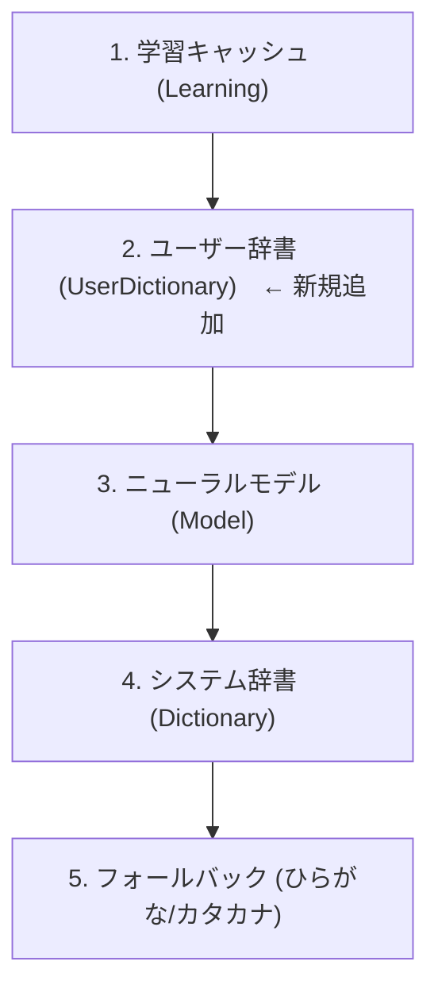
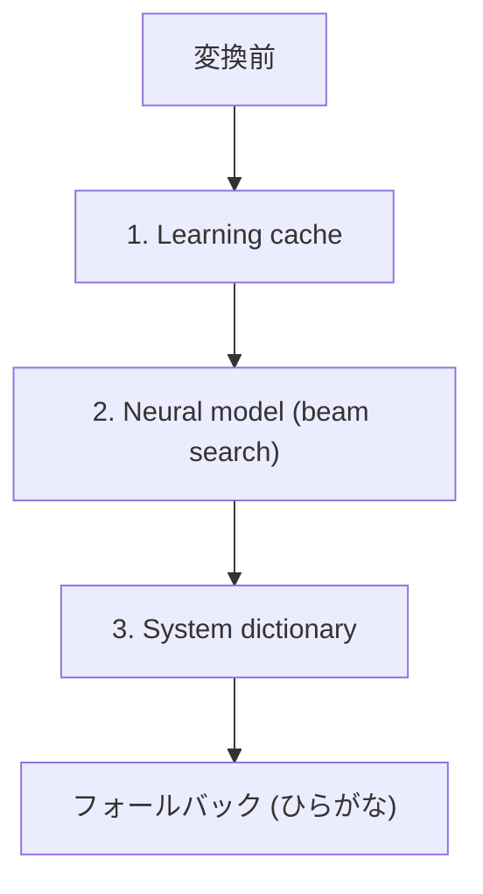
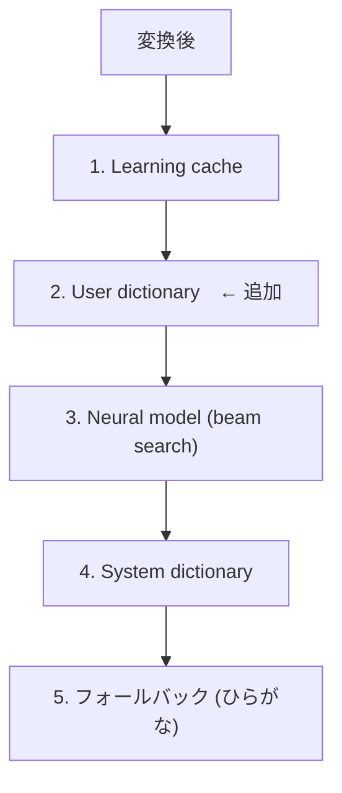

# macOS ユーザー辞書サポート — 設計・実装計画

## 背景

Linux 版 (`karukan-im`) では既にユーザー辞書が完全実装されている。macOS 版 (`karukan-macos`) では `paths::user_dict_dir()` が定義済みだが、`session.rs` の `init_resources()` でロードしていない。候補優先度の組み立て (`build_candidates`) にもユーザー辞書スロットがない。

本計画は Linux 版の実装をリファレンスに、macOS 版にユーザー辞書サポートを追加する。

## 仕様

### TSV フォーマット (Mozc/Google IME 互換)

```text
# karukan ユーザー辞書
# ヨミ<TAB>表層形<TAB>品詞<TAB>コメント
# 品詞・コメントは省略可能
かるかん	Karukan
あずーきー	azooKey
ごーるでんうぃーく	GW	短縮よみ
```

- `#` で始まる行はコメント（スキップ）
- 最低2カラム（ヨミ, 表層形）。3・4カラム目（品詞, コメント）は任意
- ヨミはひらがな（`Dictionary::load_auto` 内部で Unicode 正規化される）
- エンコーディング: UTF-8

### 辞書ファイル配置

```text
~/Library/Application Support/Karukan/user_dicts/
├── my_dict.tsv
├── names.tsv
└── tech_terms.tsv        # 複数ファイル可。ファイル名ソート順で優先度決定
```

- `paths::user_dict_dir()` = `~/Library/Application Support/Karukan/user_dicts/`
- ディレクトリ内の全ファイルを `Dictionary::load_auto()` で読み込み
    - KRKN バイナリ形式と Mozc TSV 形式を自動判別
- ファイル名アルファベット順でソート → 先のファイルが高優先度
- 複数辞書は `Dictionary::merge()` で統合

### 候補優先度



Linux 版と同一の優先度順。

### 利用手順（UI なし）

1. `~/Library/Application Support/Karukan/user_dicts/` にTSVファイルを配置
2. IME拡張プロセスを再起動（`killall KarukanIMExtension`）
3. 辞書のエントリが変換候補に反映される

## 実装計画

### Step 1: `KarukanSession` にユーザー辞書フィールドを追加

**ファイル**: `karukan-macos/src/session.rs`

`KarukanSession` 構造体に以下を追加する:

- `user_dict: Option<karukan_engine::Dictionary>` フィールドを既存の `dict` フィールドの直後に追加
- `new()` コンストラクタで `user_dict: None` として初期化

### Step 2: `init_resources()` でユーザー辞書をロード

**ファイル**: `karukan-macos/src/session.rs`

システム辞書ロードの直後に、以下のロジックを追加する。Linux 版 `init.rs:init_user_dictionaries()` とほぼ同じ実装:

- `paths::user_dict_dir()` でディレクトリパスを取得し、存在確認
- ディレクトリ内のファイル一覧をアルファベット順にソート
- 各ファイルに対して `Dictionary::load_auto(path)` を実行
  - 成功: `dicts` ベクタに追加し `tracing::info!` でログ出力
  - 失敗: `tracing::warn!` でスキップ
- `dicts` が空でなければ `Dictionary::merge(dicts)` で統合し `self.user_dict` に格納

### Step 3: `build_candidates()` にユーザー辞書を組み込む

**ファイル**: `karukan-macos/src/session.rs`

現在の `build_candidates()` (L928付近) の候補収集順は以下の通り:



これを以下の順序に変更する:



具体的な変更点:

- Learning cache 検索の直後、Neural model 検索の直前に `self.user_dict` の `exact_match_search(hiragana)` を呼び出す
- 取得した候補を重複排除しながら `result` ベクタに追加する
- それ以外の既存ロジック（1, 3, 4, 5 のステップ）はそのまま維持

### Step 4: テスト

**ファイル**: `karukan-macos/src/session.rs` (既存テストモジュールに追加)

テストケースの方針:

- `KARUKAN_DATA_DIR` 環境変数でテスト用一時ディレクトリを指定
- `user_dicts/` 以下に TSV ファイルを作成して `init_resources()` を呼び出す
- `build_candidates()` でユーザー辞書エントリがモデル・システム辞書より前に出ることを確認
- モデルなし（`converter: None`）でも辞書候補が正しく返ることを確認
- 空ディレクトリ、不正ファイル、複数ファイルのケースをカバー

## 変更対象ファイル

| ファイル | 変更内容 |
|---|---|
| `karukan-macos/src/session.rs` | `user_dict` フィールド追加、`init_resources()` にロード処理、`build_candidates()` に辞書検索追加 |

## 追加不要なもの

- **karukan-engine 側の変更**: 不要。`Dictionary::load_auto()`, `Dictionary::merge()`, Mozc TSV パーサーは全て既存
- **paths.rs**: `user_dict_dir()` は既に定義済み
- **FFI 層**: 変更不要。候補リストの構築は Rust 側で完結
- **Swift 側**: 変更不要。候補の表示ロジックは既存のまま
- **UI**: 今回スコープ外

## リスク・注意点

- Mozc TSV は起動時にダブルアレイトライを毎回構築するため、大規模辞書（1万語超）ではロード時間が増加する。将来的には `karukan-dict build` で事前バイナリ化を推奨
- App Sandbox 環境下では `~/Library/Application Support/Karukan/` は実際にはコンテナ内 (`~/Library/Containers/com.example.inputmethod.KarukanIM/Data/Library/Application Support/Karukan/`) にリダイレクトされる。ユーザーへの案内時に注意が必要
