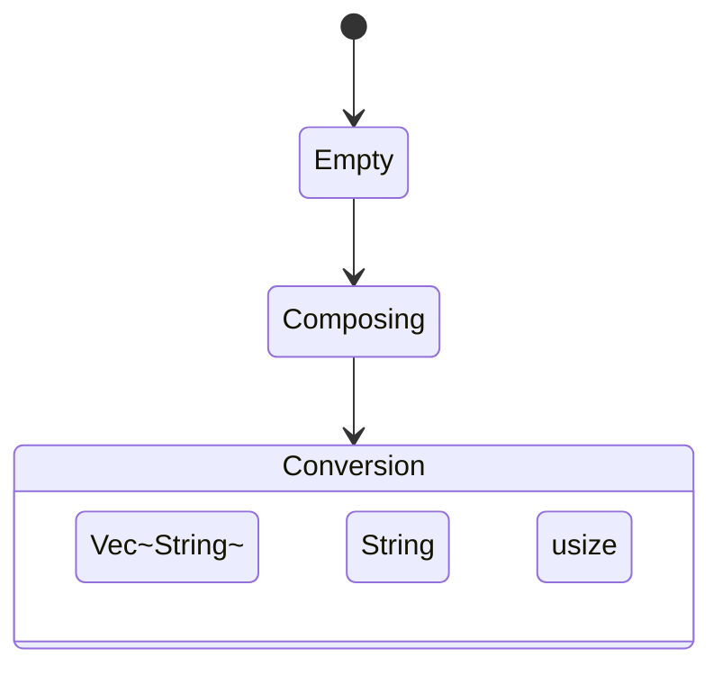
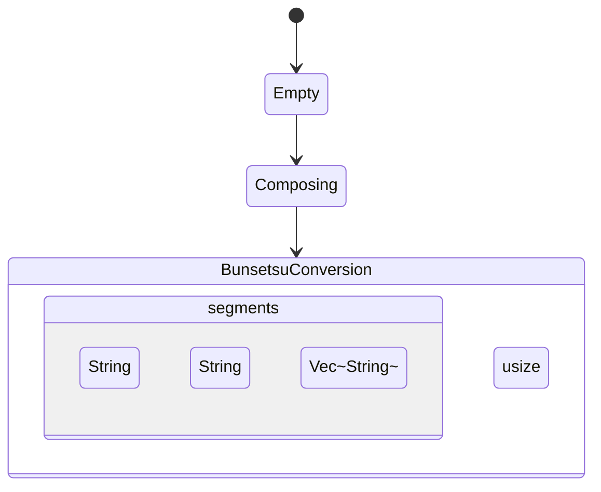

# 文節ナビゲーション — 設計・実装計画

## 背景

スペースキーで変換モードに入った後、左右矢印キーで文節を移動し、各文節ごとに候補を選べる機能を追加する。macOS 標準 IME や Google IME と同等の文節変換 UX を実現する。

## 仕様

### キー操作

| キー | 状態 | 動作 |
|---|---|---|
| Space | Composing | 文節変換モードへ（最初の文節を選択 + 候補パネル表示） |
| ← Left | BunsetsuConversion | 前の文節を選択（候補パネルを閉じる） |
| → Right | BunsetsuConversion | 次の文節を選択（候補パネルを閉じる） |
| Space / Tab / ↓ | BunsetsuConversion（パネル非表示時） | 選択文節の候補パネルを表示 |
| Space / Tab / ↓ | BunsetsuConversion（パネル表示中） | 次候補へ（IMKCandidates が処理） |
| ↑ | BunsetsuConversion（パネル表示中） | 前候補へ（IMKCandidates が処理） |
| Return | BunsetsuConversion（パネル非表示） | 全文節を確定コミット |
| Return | BunsetsuConversion（パネル表示中） | 候補を確定 → 文節ナビに戻る |
| Escape | BunsetsuConversion（パネル表示中） | 候補パネルを閉じる（文節ナビは継続） |
| Escape | BunsetsuConversion（パネル非表示） | 変換キャンセル → Composing（ひらがな復元） |
| Backspace | BunsetsuConversion | 変換キャンセル → Composing → 末尾1文字削除 |
| Ctrl+O / Shift+Right | BunsetsuConversion | 選択文節を1文字延ばす（次の文節先頭1文字を移動） |
| Ctrl+I / Shift+Left | BunsetsuConversion | 選択文節を1文字縮める（末尾1文字を次の文節先頭へ移動） |

### 表示

- **選択文節**: thick アンダーライン（`NSUnderlineStyle.thick`）
- **非選択文節**: single アンダーライン（`NSUnderlineStyle.single`）
- 候補パネルの候補移動中も全文節を表示し、選択文節の表示が候補テキストに追従する

### ライブ変換との連携

| 状態 | キー | 動作 |
|---|---|---|
| Composing（ライブ変換あり） | Left | BunsetsuConversion に入り、**最後の文節**を選択 |
| Composing（ライブ変換なし） | Left | アプリにパススルー（ひらがなカーソル移動、従来通り） |
| BunsetsuConversion | — | `apply_live_candidate` が Composing 状態チェックで自動的に無視 |

**ライブ変換中 Left の意図**: ユーザーは変換済みテキスト全体を見ながら「末尾を直したい」と判断して Left を押す。したがって最後の文節が選択された状態で入る。

---

## 状態機械の変更

### 変更前



### 変更後



候補パネルの表示/非表示は `candidate_cache.items` の空/非空で制御（既存方式を踏襲）。

---

## 文節分割アルゴリズム

形態素解析器（MeCab 等）は不使用。助詞ベースのヒューリスティックで分割する。

**規則**：
- 2文字助詞（優先）: `から` `まで` `より` `って` `けど` `ので` `のに` `には` `では` `とは` `でも` `とも`
- 1文字助詞: `は` `が` `を` `に` `で` `へ` `と` `も` `の` `や` `か`
- 助詞をその文節の末尾に含め、直後で分割する
- 助詞の後ろに文字がない場合は分割しない
- 分割結果が 0 の場合は全体を 1 文節とする

**例**:

```text
"わたしはがっこうへいきます"
→ ["わたしは", "がっこうへ", "いきます"]

"せんたく"
→ ["せんたく"]  （単一文節）

"きょうはいいてんきですね"
→ ["きょうは", "いいてんきですね"]
```

---

## 実装計画

### Step 1: `session.rs` — 状態定義を置き換える

**ファイル**: `karukan-macos/src/session.rs`

`ConversionState` / `SessionState::Conversion` を削除し、新しい型に置き換える:

- `BunsetsuSegment` 構造体: `hiragana: String`、`display: String`、`candidates: Vec<String>` の3フィールド
- `BunsetsuConversionState` 構造体: `segments: Vec<BunsetsuSegment>` と `selected: usize` を保持
- `SessionState` enum: `Empty`、`Composing`、`BunsetsuConversion(BunsetsuConversionState)` の3バリアント

### Step 2: `session.rs` — `segment_hiragana()` 自由関数を追加

ひらがな文字列を助詞境界で文節に分割する自由関数 `segment_hiragana(hiragana: &str) -> Vec<String>` を追加する。

実装のポイント:
- `chars()` でイテレート。最低 1 文字はセグメントに含める
- 2文字助詞を 1文字より優先チェック
- 助詞の直後に文字がある場合のみ分割（末尾の助詞は分割しない）

### Step 3: `session.rs` — `do_conversion()` を置き換える

`do_conversion_impl(start_at_last: bool)` を実装し、`do_conversion()` はそのラッパーとする。

`do_conversion_impl` の処理:

1. ローマ字バッファをフラッシュ
2. ひらがなが空なら全角スペースをコミット（既存動作を維持）
3. `prev_live = self.live_candidate.take()`
4. `segment_hiragana(hiragana)` で文節に分割
5. 各文節に対して `collect_candidates(hiragana)` で候補を収集
6. 単一文節かつ `prev_live` がある場合: 候補先頭に挿入
7. `initial_selected = if start_at_last { segments.len() - 1 } else { 0 }`
8. `initial_selected` 番の文節の候補を `candidate_cache` に設定（パネル即表示）
9. `SessionState::BunsetsuConversion` へ遷移（`selected: initial_selected`）
10. `preedit` = 全文節の `display` を結合したテキスト（キャレットは選択文節末尾）

### Step 4: `session.rs` — `push_key()` を更新

`SessionState::Conversion` のハンドラを `BunsetsuConversion` に置き換える。各キーの処理:

| キー | 処理 |
|---|---|
| Return | `commit_bunsetsu_all()` |
| Escape | `candidate_cache` が空なら `cancel_bunsetsu()`、非空なら `candidate_cache.clear()` |
| Backspace | `cancel_bunsetsu()` + `do_backspace()` |
| Left | `move_segment(-1)` |
| Right | `move_segment(1)` |
| Space / Tab / Down | `show_segment_candidates()` |
| Up | 消費（`true` を返す） |

**Composing 状態での Left 追加処理**: ライブ変換中（`live_candidate.is_some()`）に Left が押されたとき、`do_conversion_impl(start_at_last: true)` を呼び出して最後の文節を選択状態で BunsetsuConversion に入る。ライブ変換がない Composing 状態での Left は引き続き `false` を返し、アプリに委ねる（ひらがなカーソル移動）。

`push_char()` での `cancel_conversion()` 呼び出しも `cancel_bunsetsu()` に置き換える。

### Step 5: `session.rs` — 新メソッドを追加

#### `move_segment(delta: i32)`

- `selected` を ±1（clamp）
- `candidate_cache` を空にする（パネルを隠す）
- preedit を全文節の `display` で更新（caret = 選択文節末尾）

#### `show_segment_candidates()`

- `segments[selected].candidates` を `candidate_cache` に設定する

#### `commit_bunsetsu_all()`

- 全 `segments` の `display` を結合してコミット
- `display != hiragana` の文節を学習キャッシュに記録
- `SessionState::Empty` へ遷移

#### `cancel_bunsetsu()`

- `segments` の `hiragana` を結合してひらがな文字列を復元
- `SessionState::Composing` へ遷移し、preedit をひらがなで更新

### Step 6: `session.rs` — `select_candidate()` を更新

`BunsetsuConversion` 状態の場合の処理:

- `segments[selected].display` を選択候補で更新
- 学習キャッシュに記録
- `candidate_cache` を空にする（パネルを隠す）
- `commit.dirty = false` のまま（コミットしない）
- preedit を更新して返す

Swift の `candidateSelected` が `karukan_has_commit() == 0` を確認してパネルを隠し `updateClientState` を呼ぶことで、段階的な文節選択 UI を実現する。

### Step 7: `session.rs` — クエリメソッドを追加

以下の3つのクエリメソッドを追加する:

- `segment_count(&self) -> usize`: `BunsetsuConversion` 状態のセグメント数（非変換状態なら 0）
- `selected_segment(&self) -> usize`: 現在選択中のセグメントインデックス
- `segment_char_count(&self, index: usize) -> usize`: セグメント `index` の `display` の `chars().count()`（UTF-16 BMP 範囲の日本語文字は 1 コードポイント = 1 NSString 文字）

### Step 8: `session.rs` — `restore_hiragana_if_conversion()` を更新

`Conversion` を `BunsetsuConversion` に対応させる。`BunsetsuConversionState` の場合は `segments` 内の各 `hiragana` を結合してひらがな文字列を復元し、Composing 状態に戻す。

### Step 9: `ffi/query.rs` — セグメント情報 FFI を追加

以下の3つの C FFI 関数を追加する:

- `karukan_get_segment_count(session: *const KarukanSession) -> u32`
- `karukan_get_segment_char_count(session: *const KarukanSession, index: u32) -> u32`
- `karukan_get_selected_segment(session: *const KarukanSession) -> u32`

### Step 10: `karukan_macos.h` — ヘッダーに宣言を追加

以下の3関数の C 宣言を追加する:

| 関数シグネチャ | 説明 |
|---|---|
| `uint32_t karukan_get_segment_count(const KarukanSession* session)` | BunsetsuConversion 状態のセグメント数を返す。0 なら非文節変換状態。 |
| `uint32_t karukan_get_segment_char_count(const KarukanSession* session, uint32_t index)` | セグメント index の現在表示テキストの文字数（NSString 長）を返す。 |
| `uint32_t karukan_get_selected_segment(const KarukanSession* session)` | 現在選択中のセグメントインデックスを返す。 |

### Step 11: `KarukanInputController.swift` — 候補パネル表示中の Left/Right 処理

候補パネル表示中のキーハンドリングブロックに以下を追加する:

- **Left（keyCode 123）**: `karukan_push_key` に `.left` を送信 → `updateClientState` → `panel.hide()`
- **Right（keyCode 124）**: `karukan_push_key` に `.right` を送信 → `updateClientState` → `panel.hide()`

### Step 12: `KarukanInputController.swift` — `candidateSelected` を更新

`karukan_has_commit(session)` の戻り値で処理を分岐する:

- **コミットあり（非ゼロ）**: 既存の通常コミット処理を実行し、`setMarkedText("")` でマークを消す
- **コミットなし（ゼロ）**: 文節候補の確定として、`candidatesPanel?.hide()` → `updateClientState` のみ実行し、文節ナビに戻る

### Step 13: `KarukanInputController.swift` — `candidateSelectionChanged` を更新

候補パネルで矢印キーを動かしたとき、全文節を表示しつつ選択文節に候補テキストを反映する:

- `karukan_get_segment_count` でセグメント数を取得
- セグメントが存在する場合: `getSegmentTexts` で全文節テキストを構築し、選択文節だけ候補テキストで上書き → `buildSegmentAttrStr` で属性付き文字列を生成 → `setMarkedText` でキャレット位置を選択文節末尾に設定
- セグメントがない場合: 既存の動作（単一文字列をアンダーライン付きで表示）

### Step 14: `KarukanInputController.swift` — `updateClientState` を更新

`karukan_get_segment_count > 0` のとき、文節ごとに異なるアンダーラインを描画する:

- セグメントが存在する場合: `getSegmentTexts` で全文節テキストを取得 → `buildSegmentAttrStr` で選択文節に thick、それ以外に single アンダーラインを設定 → キャレットを選択文節末尾に配置して `setMarkedText`
- セグメントがない場合: 既存の動作（単一アンダーライン）

#### ヘルパー関数

**`getSegmentTexts(session:segmentCount:overrideIndex:overrideText:)`**

`karukan_get_preedit` の文字列を `karukan_get_segment_char_count` で分割し `[String]` を返す。`overrideIndex` が指定された場合はそのインデックスを `overrideText` で上書きする。

**`buildSegmentAttrStr(segTexts:[String], selectedSeg:Int)`**

`segTexts` を結合し、各文節に `.underlineStyle` を設定した `NSMutableAttributedString` を返す:
- `selectedSeg` の文節: `NSUnderlineStyle.thick.rawValue`
- それ以外: `NSUnderlineStyle.single.rawValue`

---

## 変更対象ファイル

| ファイル | 変更内容 |
|---|---|
| `karukan-macos/src/session.rs` | `ConversionState` 削除、`BunsetsuConversionState` 追加、関連メソッド全面更新 |
| `karukan-macos/src/ffi/query.rs` | `karukan_get_segment_count/char_count/selected_segment` 追加 |
| `karukan-macos/include/karukan_macos.h` | 3 関数の C 宣言を追加 |
| `macos/KarukanIM/KarukanIM/KarukanInputController.swift` | パネル表示中 Left/Right ハンドリング、`candidateSelected` / `candidateSelectionChanged` / `updateClientState` 更新 |

### 文節伸縮（追加実装）

| ファイル | 変更内容 |
|---|---|
| `karukan-macos/include/karukan_macos.h` | `KARUKAN_KEY_SHRINK_SEGMENT = 13`, `KARUKAN_KEY_EXTEND_SEGMENT = 14` を追加 |
| `karukan-macos/src/session.rs` | `KarukanKey` enum に `ShrinkSegment`/`ExtendSegment` を追加、`resize_segment()` メソッド実装、`push_key()` に match arm 追加 |
| `macos/KarukanIM/KarukanIM/KarukanInputController.swift` | `KarukanMacOSKey` に `shrinkSegment`/`extendSegment` 追加、Ctrl+I/O および Shift+Left/Right のハンドリングを追加 |

---

---

## 文節伸縮の実装詳細

### `resize_segment(delta: i32)` — `session.rs`

`move_segment` と同じパターン（可変借用 → 計算 → 解放 → preedit 更新）で実装。

**Extend (delta > 0 / Ctrl+O / Shift+Right):**
- 次の文節が存在しない場合は no-op（最後の文節は延ばせない）
- 次の文節の先頭1文字を現在の文節末尾に追加
- `display = hiragana`, `candidates.clear()` で遅延ロードをリセット
- 次の文節が空になれば `segments.remove(sel + 1)`

**Shrink (delta < 0 / Ctrl+I / Shift+Left):**
- 現在の文節が1文字以下の場合は no-op（最小1文字制約）
- 現在の文節の末尾1文字を取り出し、**新しい独立した文節として `sel+1` に insert する**
- 後続の既存文節はそのまま後ろへずれ、内容・候補は変更しない
- 縮まった現在の文節は `display = hiragana`, `candidates.clear()` でリセット

いずれも `candidate_cache` をクリアしてパネルを隠し、preedit を全文節で再構築する。

### Swift キーハンドリングの設計

| パス | Ctrl+I / Ctrl+O | Shift+Left / Shift+Right |
|---|---|---|
| 候補パネル表示中（Ctrl ブロック） | `shrinkSegment` / `extendSegment` を送信、パネルを閉じる | — |
| 候補パネル表示中（case 123/124） | — | Shift 修飾を検出して `shrinkSegment` / `extendSegment` を送信 |
| 通常パス（line 275 の control guard より前） | BunsetsuConversion 状態のときのみ消費、それ以外は `return false` | BunsetsuConversion 状態のときのみ消費、それ以外は `return false` |

BunsetsuConversion 状態の検出は `karukan_get_segment_count(session) > 0` で行う。Ctrl+I/O を非変換状態で飲み込まないことで、テキストエディタ等への影響を防ぐ。

---

## 追加不要なもの

- **karukan-engine の変更**: 不要。`collect_candidates` は既存の `collect_candidates()` メソッドを流用
- **形態素解析器**: 不要。助詞ベースのヒューリスティックで十分
- **新しい FFI 関数（`select_candidate` 以外）**: 変更なし。`karukan_select_candidate` が BunsetsuConversion でも動作するよう内部実装を変更するだけ

---

## リスク・注意点

1. **助詞ベース分割の精度**: 形態素解析を使わないため、「でも」を助詞として分割してしまうケースがある（例:「でもいい」→「でも」＋「いい」ではなく「でもいい」のまま保ちたい）。初期実装として許容し、将来的に改善可能
2. **`move_candidate` の除去**: 現行コードの `move_candidate()` は実際には呼ばれない（パネル表示中は Swift が Space を IMKCandidates に委譲するため）。除去しても動作は変わらない
3. **`NSRange` の文字カウント**: `karukan_get_segment_char_count` は `display.chars().count()` を返す。日本語は全て BMP 範囲（1 コードポイント = 1 NSString 文字 = 1 Swift `Character`）なので NSRange.length と一致する
4. **Backspace 動作**: パネル表示中の Backspace は Swift が Escape として Rust に送る（既存動作）。Escape は `candidate_cache` をクリアして文節ナビに戻る。パネル非表示時の Backspace は `cancel_bunsetsu() + do_backspace()` でひらがなに戻り末尾を削除する

---

## 検証方法

ビルドコマンド:
- `cargo build -p karukan-macos --release` で Rust ライブラリをビルド
- `xcodebuild -scheme KarukanIMExtension build` で Swift アプリをビルド
- `cargo test -p karukan-macos` で Rust 単体テストを実行

手動動作確認シナリオ:

| # | 操作 | 期待結果 |
|---|---|---|
| 1 | "せんたく" + Space | 候補パネル表示、"選択" に thick アンダーライン |
| 2 | "わたしはがっこうへ" + Space | 2文節以上に分割、最初の文節選択 |
| 2b | ライブ変換中に Left | 最後の文節を選択して BunsetsuConversion に入る |
| 3 | BunsetsuConversion 中に Left | 前の文節に移動（パネルが隠れる） |
| 4 | BunsetsuConversion 中に Right | 次の文節に移動 |
| 5 | BunsetsuConversion 中に Space | 選択文節の候補パネル表示 |
| 6 | パネル表示中に ↓ | 次候補へ（preedit の選択文節が更新） |
| 7 | パネル表示中に Return | 文節候補を確定、文節ナビに戻る |
| 8 | パネル非表示中に Return | 全文節を確定コミット |
| 9 | パネル表示中に Escape | パネルを閉じて文節ナビへ |
| 10 | パネル非表示中に Escape | Composing（ひらがな）に戻る |

文節伸縮シナリオ:

| # | 操作 | 期待結果 |
|---|---|---|
| 11 | "わたしはがっこうへいきます" + Space → Ctrl+O | 最初の文節が1文字延びる |
| 12 | Shift+Right | Ctrl+O と同じ動作 |
| 13 | Ctrl+I | 文節が1文字縮み、縮んだ1文字が次の文節先頭へ移動 |
| 14 | Shift+Left | Ctrl+I と同じ動作 |
| 15 | 1文字の文節で Ctrl+I | 何も起きない（クラッシュしない） |
| 16 | 最後の文節で Ctrl+O | 何も起きない（クラッシュしない） |
| 17 | 候補パネル表示中に Ctrl+O / Shift+Right | パネルが閉じて文節拡大 |
| 18 | Empty / Composing 状態で Ctrl+I / Ctrl+O | アプリにパススルー |
